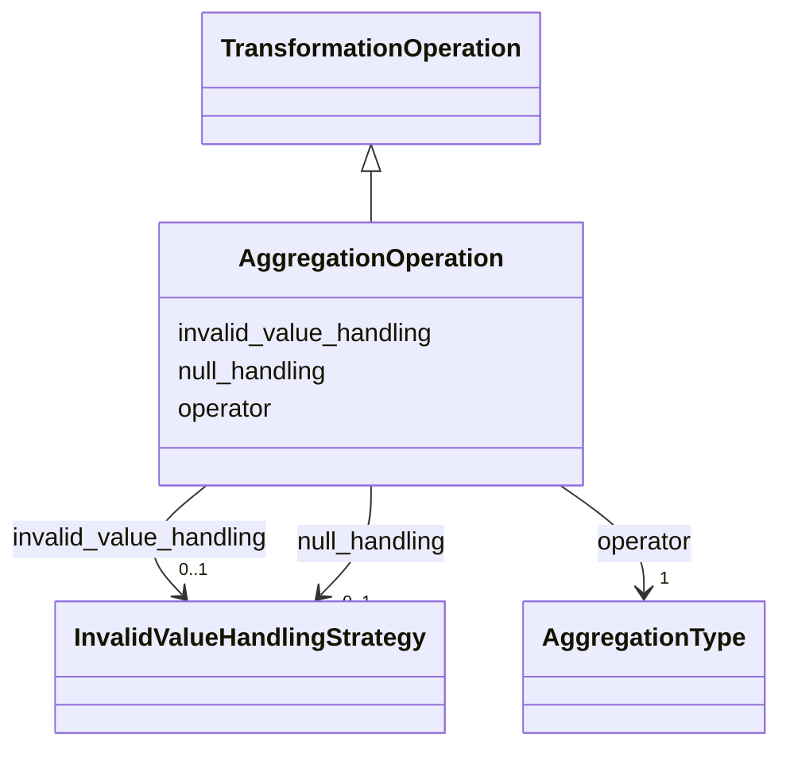

---
search:
  boost: 10.0
---

# Class: AggregationOperation 

<div data-search-exclude markdown="1">


URI: [linkmlmap:AggregationOperation](https://w3id.org/linkml/transformer/AggregationOperation)





## Inheritance
* [TransformationOperation](TransformationOperation.md)
    * **AggregationOperation**


## Slots

| Name | Cardinality and Range | Description | Inheritance |
| ---  | --- | --- | --- |
| [operator](operator.md) | 1 <br/> [AggregationType](AggregationType.md) |  | direct |
| [null_handling](null_handling.md) | 0..1 <br/> [InvalidValueHandlingStrategy](InvalidValueHandlingStrategy.md) |  | direct |
| [invalid_value_handling](invalid_value_handling.md) | 0..1 <br/> [InvalidValueHandlingStrategy](InvalidValueHandlingStrategy.md) |  | direct |


## Usages

| used by | used in | type | used |
| ---  | --- | --- | --- |
| [SlotDerivation](SlotDerivation.md) | [aggregation_operation](aggregation_operation.md) | range | [AggregationOperation](AggregationOperation.md) |


## Identifier and Mapping Information


### Schema Source


* from schema: https://w3id.org/linkml/transformer


## Mappings

| Mapping Type | Mapped Value |
| ---  | ---  |
| self | linkmlmap:AggregationOperation |
| native | linkmlmap:AggregationOperation |


## LinkML Source

<!-- TODO: investigate https://stackoverflow.com/questions/37606292/how-to-create-tabbed-code-blocks-in-mkdocs-or-sphinx -->

### Direct

<details>
```yaml
name: AggregationOperation
from_schema: https://w3id.org/linkml/transformer
is_a: TransformationOperation
attributes:
  operator:
    name: operator
    from_schema: https://w3id.org/linkml/transformer
    rank: 1000
    domain_of:
    - AggregationOperation
    range: AggregationType
    required: true
  null_handling:
    name: null_handling
    from_schema: https://w3id.org/linkml/transformer
    rank: 1000
    domain_of:
    - AggregationOperation
    - GroupingOperation
    range: InvalidValueHandlingStrategy
  invalid_value_handling:
    name: invalid_value_handling
    from_schema: https://w3id.org/linkml/transformer
    rank: 1000
    domain_of:
    - AggregationOperation
    range: InvalidValueHandlingStrategy

```
</details>

### Induced

<details>
```yaml
name: AggregationOperation
from_schema: https://w3id.org/linkml/transformer
is_a: TransformationOperation
attributes:
  operator:
    name: operator
    from_schema: https://w3id.org/linkml/transformer
    rank: 1000
    owner: AggregationOperation
    domain_of:
    - AggregationOperation
    range: AggregationType
    required: true
  null_handling:
    name: null_handling
    from_schema: https://w3id.org/linkml/transformer
    rank: 1000
    owner: AggregationOperation
    domain_of:
    - AggregationOperation
    - GroupingOperation
    range: InvalidValueHandlingStrategy
  invalid_value_handling:
    name: invalid_value_handling
    from_schema: https://w3id.org/linkml/transformer
    rank: 1000
    owner: AggregationOperation
    domain_of:
    - AggregationOperation
    range: InvalidValueHandlingStrategy

```
</details></div>