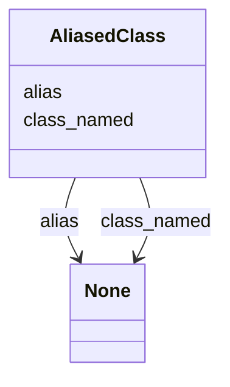

# Class: AliasedClass


_alias-class key value pairs for classes_


URI: [linkmltr:AliasedClass](https://w3id.org/linkml/transformer/AliasedClass)





<!-- no inheritance hierarchy -->


## Slots

| Name | Cardinality and Range | Description | Inheritance |
| ---  | --- | --- | --- |
| [alias](alias.md) | 0..1 <br/> [String](String.md) | name of the class to be aliased | direct |
| [class_named](class_named.md) | 0..1 <br/> [String](String.md) | local alias for the class | direct |


## Usages

| used by | used in | type | used |
| ---  | --- | --- | --- |
| [ClassDerivation](ClassDerivation.md) | [joins](joins.md) | range | [AliasedClass](AliasedClass.md) |


## Identifier and Mapping Information


### Schema Source


* from schema: https://w3id.org/linkml/transformer


## Mappings

| Mapping Type | Mapped Value |
| ---  | ---  |
| self | linkmltr:AliasedClass |
| native | linkmltr:AliasedClass |


## LinkML Source

<!-- TODO: investigate https://stackoverflow.com/questions/37606292/how-to-create-tabbed-code-blocks-in-mkdocs-or-sphinx -->

### Direct

<details>
```yaml
name: AliasedClass
description: alias-class key value pairs for classes
from_schema: https://w3id.org/linkml/transformer
attributes:
  alias:
    name: alias
    description: name of the class to be aliased
    from_schema: https://w3id.org/linkml/transformer
    rank: 1000
    key: true
    domain_of:
    - AliasedClass
    required: true
  class_named:
    name: class_named
    description: local alias for the class
    from_schema: https://w3id.org/linkml/transformer
    rank: 1000
    domain_of:
    - AliasedClass

```
</details>

### Induced

<details>
```yaml
name: AliasedClass
description: alias-class key value pairs for classes
from_schema: https://w3id.org/linkml/transformer
attributes:
  alias:
    name: alias
    description: name of the class to be aliased
    from_schema: https://w3id.org/linkml/transformer
    rank: 1000
    key: true
    alias: alias
    owner: AliasedClass
    domain_of:
    - AliasedClass
    required: true
  class_named:
    name: class_named
    description: local alias for the class
    from_schema: https://w3id.org/linkml/transformer
    rank: 1000
    alias: class_named
    owner: AliasedClass
    domain_of:
    - AliasedClass

```
</details>