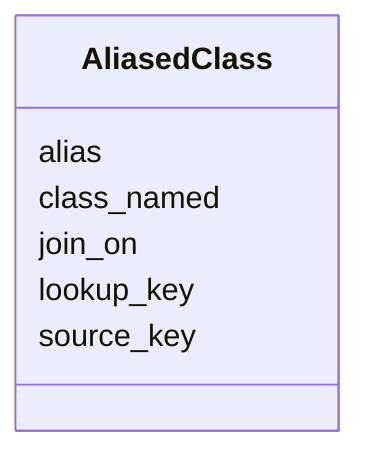

---
search:
  boost: 10.0
---

# Class: AliasedClass 


_alias-class key value pairs for classes_


<div data-search-exclude markdown="1">


URI: [linkmlmap:AliasedClass](https://w3id.org/linkml/transformer/AliasedClass)



```mermaid
 classDiagram
    class AliasedClass
    click AliasedClass href "../AliasedClass/"
      AliasedClass : alias
        
      AliasedClass : class_named
        
      AliasedClass : join_on
        
      AliasedClass : lookup_key
        
      AliasedClass : source_key
        
      
```


<!-- no inheritance hierarchy -->

## Slots

| Name | Cardinality and Range | Description | Inheritance |
| ---  | --- | --- | --- |
| [alias](alias.md) | 1 <br/> [String](String.md) | name of the class to be aliased | direct |
| [class_named](class_named.md) | 0..1 <br/> [String](String.md) | local alias for the class | direct |
| [source_key](source_key.md) | 0..1 <br/> [String](String.md) | column in the primary (populated_from) table used as the join key | direct |
| [lookup_key](lookup_key.md) | 0..1 <br/> [String](String.md) | column in the secondary (joined) table used as the join key | direct |
| [join_on](join_on.md) | 0..1 <br/> [String](String.md) | shorthand for source_key and lookup_key when both share the same column name | direct |


## Usages

| used by | used in | type | used |
| ---  | --- | --- | --- |
| [ClassDerivation](ClassDerivation.md) | [joins](joins.md) | range | [AliasedClass](AliasedClass.md) |


## Identifier and Mapping Information


### Schema Source


* from schema: https://w3id.org/linkml/transformer


## Mappings

| Mapping Type | Mapped Value |
| ---  | ---  |
| self | linkmlmap:AliasedClass |
| native | linkmlmap:AliasedClass |


## LinkML Source

<!-- TODO: investigate https://stackoverflow.com/questions/37606292/how-to-create-tabbed-code-blocks-in-mkdocs-or-sphinx -->

### Direct

<details>
```yaml
name: AliasedClass
description: alias-class key value pairs for classes
from_schema: https://w3id.org/linkml/transformer
attributes:
  alias:
    name: alias
    description: name of the class to be aliased
    from_schema: https://w3id.org/linkml/transformer
    rank: 1000
    key: true
    domain_of:
    - AliasedClass
  class_named:
    name: class_named
    description: local alias for the class
    from_schema: https://w3id.org/linkml/transformer
    rank: 1000
    domain_of:
    - AliasedClass
  source_key:
    name: source_key
    description: column in the primary (populated_from) table used as the join key
    from_schema: https://w3id.org/linkml/transformer
    rank: 1000
    domain_of:
    - AliasedClass
  lookup_key:
    name: lookup_key
    description: column in the secondary (joined) table used as the join key
    from_schema: https://w3id.org/linkml/transformer
    rank: 1000
    domain_of:
    - AliasedClass
  join_on:
    name: join_on
    description: shorthand for source_key and lookup_key when both share the same
      column name
    from_schema: https://w3id.org/linkml/transformer
    rank: 1000
    domain_of:
    - AliasedClass

```
</details>

### Induced

<details>
```yaml
name: AliasedClass
description: alias-class key value pairs for classes
from_schema: https://w3id.org/linkml/transformer
attributes:
  alias:
    name: alias
    description: name of the class to be aliased
    from_schema: https://w3id.org/linkml/transformer
    rank: 1000
    key: true
    owner: AliasedClass
    domain_of:
    - AliasedClass
    required: true
  class_named:
    name: class_named
    description: local alias for the class
    from_schema: https://w3id.org/linkml/transformer
    rank: 1000
    owner: AliasedClass
    domain_of:
    - AliasedClass
  source_key:
    name: source_key
    description: column in the primary (populated_from) table used as the join key
    from_schema: https://w3id.org/linkml/transformer
    rank: 1000
    owner: AliasedClass
    domain_of:
    - AliasedClass
  lookup_key:
    name: lookup_key
    description: column in the secondary (joined) table used as the join key
    from_schema: https://w3id.org/linkml/transformer
    rank: 1000
    owner: AliasedClass
    domain_of:
    - AliasedClass
  join_on:
    name: join_on
    description: shorthand for source_key and lookup_key when both share the same
      column name
    from_schema: https://w3id.org/linkml/transformer
    rank: 1000
    owner: AliasedClass
    domain_of:
    - AliasedClass

```
</details></div>