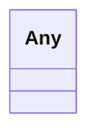

# Class: Any


URI: [linkml:Any](https://w3id.org/linkml/Any)





<!-- no inheritance hierarchy -->


## Slots

| Name | Cardinality and Range | Description | Inheritance |
| ---  | --- | --- | --- |


## Usages

| used by | used in | type | used |
| ---  | --- | --- | --- |
| [ElementDerivation](ElementDerivation.md) | [overrides](overrides.md) | range | [Any](Any.md) |
| [ClassDerivation](ClassDerivation.md) | [overrides](overrides.md) | range | [Any](Any.md) |
| [SlotDerivation](SlotDerivation.md) | [overrides](overrides.md) | range | [Any](Any.md) |
| [EnumDerivation](EnumDerivation.md) | [overrides](overrides.md) | range | [Any](Any.md) |
| [PermissibleValueDerivation](PermissibleValueDerivation.md) | [overrides](overrides.md) | range | [Any](Any.md) |
| [PrefixDerivation](PrefixDerivation.md) | [overrides](overrides.md) | range | [Any](Any.md) |
| [KeyVal](KeyVal.md) | [value](value.md) | range | [Any](Any.md) |
| [CopyDirective](CopyDirective.md) | [exclude](exclude.md) | range | [Any](Any.md) |
| [CopyDirective](CopyDirective.md) | [include](include.md) | range | [Any](Any.md) |
| [CopyDirective](CopyDirective.md) | [add](add.md) | range | [Any](Any.md) |


## Identifier and Mapping Information


### Schema Source


* from schema: https://w3id.org/linkml/transformer


## Mappings

| Mapping Type | Mapped Value |
| ---  | ---  |
| self | linkml:Any |
| native | linkmltr:Any |


## LinkML Source

<!-- TODO: investigate https://stackoverflow.com/questions/37606292/how-to-create-tabbed-code-blocks-in-mkdocs-or-sphinx -->

### Direct

<details>
```yaml
name: Any
from_schema: https://w3id.org/linkml/transformer
class_uri: linkml:Any

```
</details>

### Induced

<details>
```yaml
name: Any
from_schema: https://w3id.org/linkml/transformer
class_uri: linkml:Any

```
</details>