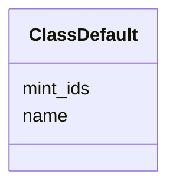

---
search:
  boost: 10.0
---

# Class: ClassDefault 


_Settings applied to every class derivation that targets this class, unless the derivation sets its own._


<div data-search-exclude markdown="1">


URI: [linkmlmap:ClassDefault](https://w3id.org/linkml/transformer/ClassDefault)





<!-- no inheritance hierarchy -->

## Slots

| Name | Cardinality and Range | Description | Inheritance |
| ---  | --- | --- | --- |
| [name](name.md) | 1 <br/> [String](String.md) | Name of the class in the target schema | direct |
| [mint_ids](mint_ids.md) | 0..1 <br/> [Boolean](Boolean.md) | Whether derivations of this class mint content-hash identifiers | direct |


## Usages

| used by | used in | type | used |
| ---  | --- | --- | --- |
| [TransformationSpecification](TransformationSpecification.md) | [class_defaults](class_defaults.md) | range | [ClassDefault](ClassDefault.md) |


## Identifier and Mapping Information


### Schema Source


* from schema: https://w3id.org/linkml/transformer


## Mappings

| Mapping Type | Mapped Value |
| ---  | ---  |
| self | linkmlmap:ClassDefault |
| native | linkmlmap:ClassDefault |


## LinkML Source

<!-- TODO: investigate https://stackoverflow.com/questions/37606292/how-to-create-tabbed-code-blocks-in-mkdocs-or-sphinx -->

### Direct

<details>
```yaml
name: ClassDefault
description: Settings applied to every class derivation that targets this class, unless
  the derivation sets its own.
from_schema: https://w3id.org/linkml/transformer
attributes:
  name:
    name: name
    description: Name of the class in the target schema
    from_schema: https://w3id.org/linkml/transformer
    identifier: true
    domain_of:
    - SchemaReference
    - ElementDerivation
    - ClassDefault
    - ObjectDerivation
    - SlotDerivation
    - EnumDerivation
    - PermissibleValueDerivation
    - Agent
  mint_ids:
    name: mint_ids
    description: Whether derivations of this class mint content-hash identifiers.
      Takes precedence over the specification's mint_ids; a class derivation's own
      mint_ids takes precedence over this.
    from_schema: https://w3id.org/linkml/transformer
    domain_of:
    - TransformationSpecification
    - ClassDefault
    - ClassDerivation
    range: boolean

```
</details>

### Induced

<details>
```yaml
name: ClassDefault
description: Settings applied to every class derivation that targets this class, unless
  the derivation sets its own.
from_schema: https://w3id.org/linkml/transformer
attributes:
  name:
    name: name
    description: Name of the class in the target schema
    from_schema: https://w3id.org/linkml/transformer
    identifier: true
    owner: ClassDefault
    domain_of:
    - SchemaReference
    - ElementDerivation
    - ClassDefault
    - ObjectDerivation
    - SlotDerivation
    - EnumDerivation
    - PermissibleValueDerivation
    - Agent
    required: true
  mint_ids:
    name: mint_ids
    description: Whether derivations of this class mint content-hash identifiers.
      Takes precedence over the specification's mint_ids; a class derivation's own
      mint_ids takes precedence over this.
    from_schema: https://w3id.org/linkml/transformer
    owner: ClassDefault
    domain_of:
    - TransformationSpecification
    - ClassDefault
    - ClassDerivation
    range: boolean

```
</details></div>