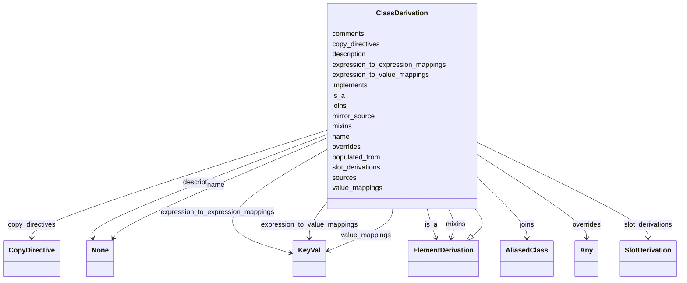

# Class: ClassDerivation


_A specification of how to derive a target class from a source class._


URI: [linkmltr:ClassDerivation](https://w3id.org/linkml/transformer/ClassDerivation)





## Inheritance
* [SpecificationComponent](SpecificationComponent.md)
    * [ElementDerivation](ElementDerivation.md)
        * **ClassDerivation**


## Slots

| Name | Cardinality and Range | Description | Inheritance |
| ---  | --- | --- | --- |
| [populated_from](populated_from.md) | 0..1 <br/> [ClassReference](ClassReference.md) | Name of the class in the source schema | direct |
| [sources](sources.md) | 0..* <br/> [ClassReference](ClassReference.md) |  | direct |
| [joins](joins.md) | 0..* <br/> [AliasedClass](AliasedClass.md) | Additional classes to be joined to derive instances of the target class | direct |
| [slot_derivations](slot_derivations.md) | 0..* <br/> [SlotDerivation](SlotDerivation.md) |  | direct |
| [name](name.md) | 1..1 <br/> [String](String.md) | Name of the element in the target schema | [ElementDerivation](ElementDerivation.md) |
| [copy_directives](copy_directives.md) | 0..* <br/> [CopyDirective](CopyDirective.md) |  | [ElementDerivation](ElementDerivation.md) |
| [overrides](overrides.md) | 0..1 <br/> [Any](Any.md) | overrides source schema slots | [ElementDerivation](ElementDerivation.md) |
| [is_a](is_a.md) | 0..1 <br/> [ElementDerivation](ElementDerivation.md) |  | [ElementDerivation](ElementDerivation.md) |
| [mixins](mixins.md) | 0..* <br/> [ElementDerivation](ElementDerivation.md) |  | [ElementDerivation](ElementDerivation.md) |
| [value_mappings](value_mappings.md) | 0..* <br/> [KeyVal](KeyVal.md) | A mapping table that is applied directly to mappings, in order of precedence | [ElementDerivation](ElementDerivation.md) |
| [expression_to_value_mappings](expression_to_value_mappings.md) | 0..* <br/> [KeyVal](KeyVal.md) | A mapping table in which the keys are expressions | [ElementDerivation](ElementDerivation.md) |
| [expression_to_expression_mappings](expression_to_expression_mappings.md) | 0..* <br/> [KeyVal](KeyVal.md) | A mapping table in which the keys and values are expressions | [ElementDerivation](ElementDerivation.md) |
| [mirror_source](mirror_source.md) | 0..1 <br/> [Boolean](Boolean.md) |  | [ElementDerivation](ElementDerivation.md) |
| [description](description.md) | 0..1 <br/> [String](String.md) | description of the specification component | [SpecificationComponent](SpecificationComponent.md) |
| [implements](implements.md) | 0..* <br/> [Uriorcurie](Uriorcurie.md) | A reference to a specification that this component implements | [SpecificationComponent](SpecificationComponent.md) |
| [comments](comments.md) | 0..* <br/> [String](String.md) | A list of comments about this component | [SpecificationComponent](SpecificationComponent.md) |


## Usages

| used by | used in | type | used |
| ---  | --- | --- | --- |
| [TransformationSpecification](TransformationSpecification.md) | [class_derivations](class_derivations.md) | range | [ClassDerivation](ClassDerivation.md) |


## Identifier and Mapping Information


### Schema Source


* from schema: https://w3id.org/linkml/transformer


## Mappings

| Mapping Type | Mapped Value |
| ---  | ---  |
| self | linkmltr:ClassDerivation |
| native | linkmltr:ClassDerivation |


## LinkML Source

<!-- TODO: investigate https://stackoverflow.com/questions/37606292/how-to-create-tabbed-code-blocks-in-mkdocs-or-sphinx -->

### Direct

<details>
```yaml
name: ClassDerivation
description: A specification of how to derive a target class from a source class.
from_schema: https://w3id.org/linkml/transformer
is_a: ElementDerivation
attributes:
  populated_from:
    name: populated_from
    description: Name of the class in the source schema
    from_schema: https://w3id.org/linkml/transformer
    rank: 1000
    domain_of:
    - ClassDerivation
    - SlotDerivation
    - EnumDerivation
    - PermissibleValueDerivation
    range: ClassReference
  sources:
    name: sources
    from_schema: https://w3id.org/linkml/transformer
    rank: 1000
    multivalued: true
    domain_of:
    - ClassDerivation
    - SlotDerivation
    - EnumDerivation
    - PermissibleValueDerivation
    range: ClassReference
  joins:
    name: joins
    description: Additional classes to be joined to derive instances of the target
      class
    comments:
    - not yet implemented
    from_schema: https://w3id.org/linkml/transformer
    rank: 1000
    multivalued: true
    domain_of:
    - ClassDerivation
    range: AliasedClass
    inlined: true
  slot_derivations:
    name: slot_derivations
    from_schema: https://w3id.org/linkml/transformer
    multivalued: true
    domain_of:
    - TransformationSpecification
    - ClassDerivation
    range: SlotDerivation
    inlined: true

```
</details>

### Induced

<details>
```yaml
name: ClassDerivation
description: A specification of how to derive a target class from a source class.
from_schema: https://w3id.org/linkml/transformer
is_a: ElementDerivation
attributes:
  populated_from:
    name: populated_from
    description: Name of the class in the source schema
    from_schema: https://w3id.org/linkml/transformer
    rank: 1000
    alias: populated_from
    owner: ClassDerivation
    domain_of:
    - ClassDerivation
    - SlotDerivation
    - EnumDerivation
    - PermissibleValueDerivation
    range: ClassReference
  sources:
    name: sources
    from_schema: https://w3id.org/linkml/transformer
    rank: 1000
    multivalued: true
    alias: sources
    owner: ClassDerivation
    domain_of:
    - ClassDerivation
    - SlotDerivation
    - EnumDerivation
    - PermissibleValueDerivation
    range: ClassReference
  joins:
    name: joins
    description: Additional classes to be joined to derive instances of the target
      class
    comments:
    - not yet implemented
    from_schema: https://w3id.org/linkml/transformer
    rank: 1000
    multivalued: true
    alias: joins
    owner: ClassDerivation
    domain_of:
    - ClassDerivation
    range: AliasedClass
    inlined: true
  slot_derivations:
    name: slot_derivations
    from_schema: https://w3id.org/linkml/transformer
    multivalued: true
    alias: slot_derivations
    owner: ClassDerivation
    domain_of:
    - TransformationSpecification
    - ClassDerivation
    range: SlotDerivation
    inlined: true
  name:
    name: name
    description: Name of the element in the target schema
    from_schema: https://w3id.org/linkml/transformer
    rank: 1000
    key: true
    alias: name
    owner: ClassDerivation
    domain_of:
    - ElementDerivation
    - SlotDerivation
    - EnumDerivation
    - PermissibleValueDerivation
    range: string
    required: true
  copy_directives:
    name: copy_directives
    from_schema: https://w3id.org/linkml/transformer
    rank: 1000
    multivalued: true
    alias: copy_directives
    owner: ClassDerivation
    domain_of:
    - ElementDerivation
    range: CopyDirective
    inlined: true
  overrides:
    name: overrides
    description: overrides source schema slots
    from_schema: https://w3id.org/linkml/transformer
    rank: 1000
    alias: overrides
    owner: ClassDerivation
    domain_of:
    - ElementDerivation
    range: Any
  is_a:
    name: is_a
    from_schema: https://w3id.org/linkml/transformer
    rank: 1000
    slot_uri: linkml:is_a
    alias: is_a
    owner: ClassDerivation
    domain_of:
    - ElementDerivation
    range: ElementDerivation
  mixins:
    name: mixins
    from_schema: https://w3id.org/linkml/transformer
    rank: 1000
    slot_uri: linkml:mixins
    multivalued: true
    alias: mixins
    owner: ClassDerivation
    domain_of:
    - ElementDerivation
    range: ElementDerivation
    inlined: false
  value_mappings:
    name: value_mappings
    description: A mapping table that is applied directly to mappings, in order of
      precedence
    from_schema: https://w3id.org/linkml/transformer
    rank: 1000
    multivalued: true
    alias: value_mappings
    owner: ClassDerivation
    domain_of:
    - ElementDerivation
    range: KeyVal
    inlined: true
  expression_to_value_mappings:
    name: expression_to_value_mappings
    description: A mapping table in which the keys are expressions
    from_schema: https://w3id.org/linkml/transformer
    rank: 1000
    multivalued: true
    alias: expression_to_value_mappings
    owner: ClassDerivation
    domain_of:
    - ElementDerivation
    range: KeyVal
    inlined: true
  expression_to_expression_mappings:
    name: expression_to_expression_mappings
    description: A mapping table in which the keys and values are expressions
    from_schema: https://w3id.org/linkml/transformer
    rank: 1000
    multivalued: true
    alias: expression_to_expression_mappings
    owner: ClassDerivation
    domain_of:
    - ElementDerivation
    range: KeyVal
    inlined: true
  mirror_source:
    name: mirror_source
    from_schema: https://w3id.org/linkml/transformer
    rank: 1000
    alias: mirror_source
    owner: ClassDerivation
    domain_of:
    - ElementDerivation
    range: boolean
  description:
    name: description
    description: description of the specification component
    from_schema: https://w3id.org/linkml/transformer
    rank: 1000
    slot_uri: dcterms:description
    alias: description
    owner: ClassDerivation
    domain_of:
    - SpecificationComponent
    range: string
  implements:
    name: implements
    description: A reference to a specification that this component implements.
    from_schema: https://w3id.org/linkml/transformer
    rank: 1000
    multivalued: true
    alias: implements
    owner: ClassDerivation
    domain_of:
    - SpecificationComponent
    range: uriorcurie
  comments:
    name: comments
    description: A list of comments about this component. Comments are free text,
      and may be used to provide additional information about the component, including
      instructions for its use.
    from_schema: https://w3id.org/linkml/transformer
    rank: 1000
    slot_uri: rdfs:comment
    multivalued: true
    alias: comments
    owner: ClassDerivation
    domain_of:
    - SpecificationComponent
    range: string

```
</details>