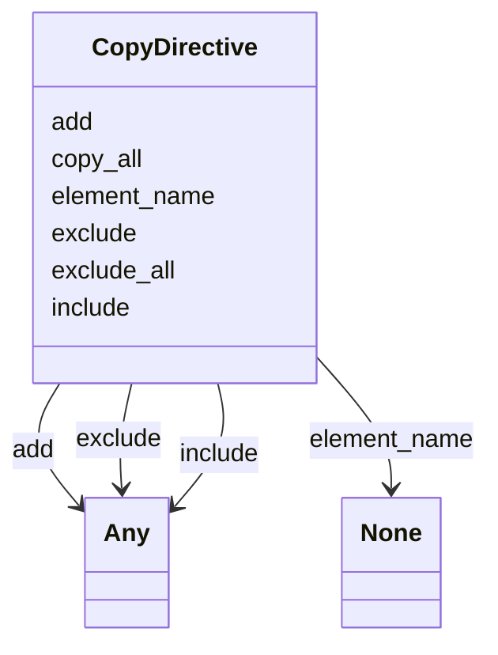

# Class: CopyDirective


_Instructs a Schema Mapper in how to map to a target schema. Not used for data transformation._


URI: [linkmltr:CopyDirective](https://w3id.org/linkml/transformer/CopyDirective)





<!-- no inheritance hierarchy -->


## Slots

| Name | Cardinality and Range | Description | Inheritance |
| ---  | --- | --- | --- |
| [element_name](element_name.md) | 0..1 <br/> [String](String.md) |  | direct |
| [copy_all](copy_all.md) | 0..1 <br/> [Boolean](Boolean.md) |  | direct |
| [exclude_all](exclude_all.md) | 0..1 <br/> [Boolean](Boolean.md) |  | direct |
| [exclude](exclude.md) | 0..1 <br/> [Any](Any.md) |  | direct |
| [include](include.md) | 0..1 <br/> [Any](Any.md) |  | direct |
| [add](add.md) | 0..1 <br/> [Any](Any.md) |  | direct |


## Usages

| used by | used in | type | used |
| ---  | --- | --- | --- |
| [ElementDerivation](ElementDerivation.md) | [copy_directives](copy_directives.md) | range | [CopyDirective](CopyDirective.md) |
| [ClassDerivation](ClassDerivation.md) | [copy_directives](copy_directives.md) | range | [CopyDirective](CopyDirective.md) |
| [SlotDerivation](SlotDerivation.md) | [copy_directives](copy_directives.md) | range | [CopyDirective](CopyDirective.md) |
| [EnumDerivation](EnumDerivation.md) | [copy_directives](copy_directives.md) | range | [CopyDirective](CopyDirective.md) |
| [PermissibleValueDerivation](PermissibleValueDerivation.md) | [copy_directives](copy_directives.md) | range | [CopyDirective](CopyDirective.md) |
| [PrefixDerivation](PrefixDerivation.md) | [copy_directives](copy_directives.md) | range | [CopyDirective](CopyDirective.md) |


## Identifier and Mapping Information


### Schema Source


* from schema: https://w3id.org/linkml/transformer


## Mappings

| Mapping Type | Mapped Value |
| ---  | ---  |
| self | linkmltr:CopyDirective |
| native | linkmltr:CopyDirective |


## LinkML Source

<!-- TODO: investigate https://stackoverflow.com/questions/37606292/how-to-create-tabbed-code-blocks-in-mkdocs-or-sphinx -->

### Direct

<details>
```yaml
name: CopyDirective
description: Instructs a Schema Mapper in how to map to a target schema. Not used
  for data transformation.
from_schema: https://w3id.org/linkml/transformer
status: testing
attributes:
  element_name:
    name: element_name
    from_schema: https://w3id.org/linkml/transformer
    rank: 1000
    key: true
    domain_of:
    - CopyDirective
    required: true
  copy_all:
    name: copy_all
    from_schema: https://w3id.org/linkml/transformer
    rank: 1000
    domain_of:
    - CopyDirective
    range: boolean
  exclude_all:
    name: exclude_all
    from_schema: https://w3id.org/linkml/transformer
    rank: 1000
    domain_of:
    - CopyDirective
    range: boolean
  exclude:
    name: exclude
    from_schema: https://w3id.org/linkml/transformer
    rank: 1000
    domain_of:
    - CopyDirective
    range: Any
  include:
    name: include
    from_schema: https://w3id.org/linkml/transformer
    rank: 1000
    domain_of:
    - CopyDirective
    range: Any
  add:
    name: add
    from_schema: https://w3id.org/linkml/transformer
    rank: 1000
    domain_of:
    - CopyDirective
    range: Any

```
</details>

### Induced

<details>
```yaml
name: CopyDirective
description: Instructs a Schema Mapper in how to map to a target schema. Not used
  for data transformation.
from_schema: https://w3id.org/linkml/transformer
status: testing
attributes:
  element_name:
    name: element_name
    from_schema: https://w3id.org/linkml/transformer
    rank: 1000
    key: true
    alias: element_name
    owner: CopyDirective
    domain_of:
    - CopyDirective
    required: true
  copy_all:
    name: copy_all
    from_schema: https://w3id.org/linkml/transformer
    rank: 1000
    alias: copy_all
    owner: CopyDirective
    domain_of:
    - CopyDirective
    range: boolean
  exclude_all:
    name: exclude_all
    from_schema: https://w3id.org/linkml/transformer
    rank: 1000
    alias: exclude_all
    owner: CopyDirective
    domain_of:
    - CopyDirective
    range: boolean
  exclude:
    name: exclude
    from_schema: https://w3id.org/linkml/transformer
    rank: 1000
    alias: exclude
    owner: CopyDirective
    domain_of:
    - CopyDirective
    range: Any
  include:
    name: include
    from_schema: https://w3id.org/linkml/transformer
    rank: 1000
    alias: include
    owner: CopyDirective
    domain_of:
    - CopyDirective
    range: Any
  add:
    name: add
    from_schema: https://w3id.org/linkml/transformer
    rank: 1000
    alias: add
    owner: CopyDirective
    domain_of:
    - CopyDirective
    range: Any

```
</details>