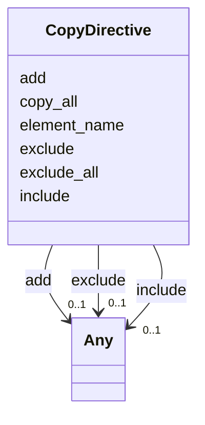

---
search:
  boost: 10.0
---

# Class: CopyDirective 


_Instructs a Schema Mapper in how to map to a target schema. Not used for data transformation._

_This is the process to process a directive: 1. If `copy_all`, add all sub-elements to the list of sub-elements to be copied. 2. If `exclude`, remove the specified sub-elements from the above list. 3. If `exclude_all`, clean-up the above list. Effectively making previous steps useless. 4. If `include`, add the specified sub-elements from the list result of previous steps._

_Implementations might decide to somehow report (error, warning,...) meaningless combinations (like specifying `copy_all` and `exclude_all`)._

_Validation on the correctness of the resulting derived schema might be done optionally by the implementation. For example, removing a slot but keeping a class that requires it would invalidate the derived-schema. It is always possible to validate the schema with the LinkML linter after derivation._

_What are the considered sub-elements depends on the calls of Element to be transformed. For example, for a class they are `slots` and `attributes`._


<div data-search-exclude markdown="1">


URI: [linkmlmap:CopyDirective](https://w3id.org/linkml/transformer/CopyDirective)



```mermaid
 classDiagram
    class CopyDirective
    click CopyDirective href "../CopyDirective/"
      CopyDirective : add
        
          
    
        
        
        CopyDirective --> "0..1" Any : add
        click Any href "../Any/"
    

        
      CopyDirective : copy_all
        
      CopyDirective : element_name
        
      CopyDirective : exclude
        
          
    
        
        
        CopyDirective --> "0..1" Any : exclude
        click Any href "../Any/"
    

        
      CopyDirective : exclude_all
        
      CopyDirective : include
        
          
    
        
        
        CopyDirective --> "0..1" Any : include
        click Any href "../Any/"
    

        
      
```


<!-- no inheritance hierarchy -->

## Slots

| Name | Cardinality and Range | Description | Inheritance |
| ---  | --- | --- | --- |
| [element_name](element_name.md) | 1 <br/> [String](String.md) | Name of the source element (class, slot, enum, etc | direct |
| [copy_all](copy_all.md) | 0..1 <br/> [Boolean](Boolean.md) | Copy all sub-elements of the Element being derived | direct |
| [exclude_all](exclude_all.md) | 0..1 <br/> [Boolean](Boolean.md) | Do not copy any of the sub-elements of the Element being derived | direct |
| [exclude](exclude.md) | 0..1 <br/> [Any](Any.md) | Remove certain sub-elements from the list of sub-elements to be copied | direct |
| [include](include.md) | 0..1 <br/> [Any](Any.md) | Add certain sub-elements to the list of sub-elements to be copied | direct |
| [add](add.md) | 0..1 <br/> [Any](Any.md) | Add new sub-elements that are not present in the source element | direct |


## Usages

| used by | used in | type | used |
| ---  | --- | --- | --- |
| [TransformationSpecification](TransformationSpecification.md) | [copy_directives](copy_directives.md) | range | [CopyDirective](CopyDirective.md) |
| [ElementDerivation](ElementDerivation.md) | [copy_directives](copy_directives.md) | range | [CopyDirective](CopyDirective.md) |
| [ClassDerivation](ClassDerivation.md) | [copy_directives](copy_directives.md) | range | [CopyDirective](CopyDirective.md) |
| [ObjectDerivation](ObjectDerivation.md) | [copy_directives](copy_directives.md) | range | [CopyDirective](CopyDirective.md) |
| [SlotDerivation](SlotDerivation.md) | [copy_directives](copy_directives.md) | range | [CopyDirective](CopyDirective.md) |
| [EnumDerivation](EnumDerivation.md) | [copy_directives](copy_directives.md) | range | [CopyDirective](CopyDirective.md) |
| [PermissibleValueDerivation](PermissibleValueDerivation.md) | [copy_directives](copy_directives.md) | range | [CopyDirective](CopyDirective.md) |
| [PrefixDerivation](PrefixDerivation.md) | [copy_directives](copy_directives.md) | range | [CopyDirective](CopyDirective.md) |


## Identifier and Mapping Information
### Administrative Metadata

**Status:** testing


### Schema Source


* from schema: https://w3id.org/linkml/transformer


## Mappings

| Mapping Type | Mapped Value |
| ---  | ---  |
| self | linkmlmap:CopyDirective |
| native | linkmlmap:CopyDirective |


## LinkML Source

<!-- TODO: investigate https://stackoverflow.com/questions/37606292/how-to-create-tabbed-code-blocks-in-mkdocs-or-sphinx -->

### Direct

<details>
```yaml
name: CopyDirective
description: 'Instructs a Schema Mapper in how to map to a target schema. Not used
  for data transformation.

  This is the process to process a directive: 1. If `copy_all`, add all sub-elements
  to the list of sub-elements to be copied. 2. If `exclude`, remove the specified
  sub-elements from the above list. 3. If `exclude_all`, clean-up the above list.
  Effectively making previous steps useless. 4. If `include`, add the specified sub-elements
  from the list result of previous steps.

  Implementations might decide to somehow report (error, warning,...) meaningless
  combinations (like specifying `copy_all` and `exclude_all`).

  Validation on the correctness of the resulting derived schema might be done optionally
  by the implementation. For example, removing a slot but keeping a class that requires
  it would invalidate the derived-schema. It is always possible to validate the schema
  with the LinkML linter after derivation.

  What are the considered sub-elements depends on the calls of Element to be transformed.
  For example, for a class they are `slots` and `attributes`.'
from_schema: https://w3id.org/linkml/transformer
status: testing
attributes:
  element_name:
    name: element_name
    description: Name of the source element (class, slot, enum, etc.) this directive
      applies to.
    from_schema: https://w3id.org/linkml/transformer
    rank: 1000
    key: true
    domain_of:
    - CopyDirective
  copy_all:
    name: copy_all
    description: Copy all sub-elements of the Element being derived.
    from_schema: https://w3id.org/linkml/transformer
    rank: 1000
    domain_of:
    - CopyDirective
    range: boolean
  exclude_all:
    name: exclude_all
    description: Do not copy any of the sub-elements of the Element being derived.
    from_schema: https://w3id.org/linkml/transformer
    rank: 1000
    domain_of:
    - CopyDirective
    range: boolean
  exclude:
    name: exclude
    description: 'Remove certain sub-elements from the list of sub-elements to be
      copied.

      As of now there it is under-specified, how to specify the sub-elements to exclude.
      One possible implementation would be a list where all element types can be mixed,
      since there might not be name conflicts across element types.'
    from_schema: https://w3id.org/linkml/transformer
    rank: 1000
    domain_of:
    - CopyDirective
    range: Any
  include:
    name: include
    description: 'Add certain sub-elements to the list of sub-elements to be copied.

      As of now there it is under-specified, how to specify the sub-elements to include.
      One possible implementation would be a list where all element types can be mixed,
      since there might not be name conflicts across element types.'
    from_schema: https://w3id.org/linkml/transformer
    rank: 1000
    domain_of:
    - CopyDirective
    range: Any
  add:
    name: add
    description: 'Add new sub-elements that are not present in the source element.
      Currently under-specified and not yet implemented (see issue #245).'
    from_schema: https://w3id.org/linkml/transformer
    rank: 1000
    domain_of:
    - CopyDirective
    range: Any

```
</details>

### Induced

<details>
```yaml
name: CopyDirective
description: 'Instructs a Schema Mapper in how to map to a target schema. Not used
  for data transformation.

  This is the process to process a directive: 1. If `copy_all`, add all sub-elements
  to the list of sub-elements to be copied. 2. If `exclude`, remove the specified
  sub-elements from the above list. 3. If `exclude_all`, clean-up the above list.
  Effectively making previous steps useless. 4. If `include`, add the specified sub-elements
  from the list result of previous steps.

  Implementations might decide to somehow report (error, warning,...) meaningless
  combinations (like specifying `copy_all` and `exclude_all`).

  Validation on the correctness of the resulting derived schema might be done optionally
  by the implementation. For example, removing a slot but keeping a class that requires
  it would invalidate the derived-schema. It is always possible to validate the schema
  with the LinkML linter after derivation.

  What are the considered sub-elements depends on the calls of Element to be transformed.
  For example, for a class they are `slots` and `attributes`.'
from_schema: https://w3id.org/linkml/transformer
status: testing
attributes:
  element_name:
    name: element_name
    description: Name of the source element (class, slot, enum, etc.) this directive
      applies to.
    from_schema: https://w3id.org/linkml/transformer
    rank: 1000
    key: true
    owner: CopyDirective
    domain_of:
    - CopyDirective
    required: true
  copy_all:
    name: copy_all
    description: Copy all sub-elements of the Element being derived.
    from_schema: https://w3id.org/linkml/transformer
    rank: 1000
    owner: CopyDirective
    domain_of:
    - CopyDirective
    range: boolean
  exclude_all:
    name: exclude_all
    description: Do not copy any of the sub-elements of the Element being derived.
    from_schema: https://w3id.org/linkml/transformer
    rank: 1000
    owner: CopyDirective
    domain_of:
    - CopyDirective
    range: boolean
  exclude:
    name: exclude
    description: 'Remove certain sub-elements from the list of sub-elements to be
      copied.

      As of now there it is under-specified, how to specify the sub-elements to exclude.
      One possible implementation would be a list where all element types can be mixed,
      since there might not be name conflicts across element types.'
    from_schema: https://w3id.org/linkml/transformer
    rank: 1000
    owner: CopyDirective
    domain_of:
    - CopyDirective
    range: Any
  include:
    name: include
    description: 'Add certain sub-elements to the list of sub-elements to be copied.

      As of now there it is under-specified, how to specify the sub-elements to include.
      One possible implementation would be a list where all element types can be mixed,
      since there might not be name conflicts across element types.'
    from_schema: https://w3id.org/linkml/transformer
    rank: 1000
    owner: CopyDirective
    domain_of:
    - CopyDirective
    range: Any
  add:
    name: add
    description: 'Add new sub-elements that are not present in the source element.
      Currently under-specified and not yet implemented (see issue #245).'
    from_schema: https://w3id.org/linkml/transformer
    rank: 1000
    owner: CopyDirective
    domain_of:
    - CopyDirective
    range: Any

```
</details></div>