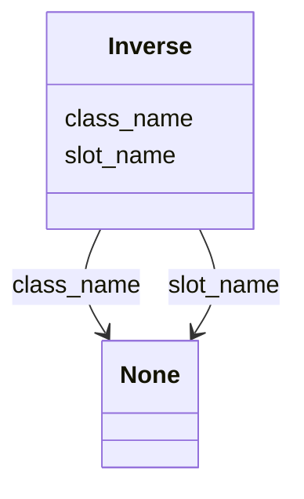

# Class: Inverse


_Used for back references in mapping to relational model_


URI: [linkmltr:Inverse](https://w3id.org/linkml/transformer/Inverse)





<!-- no inheritance hierarchy -->


## Slots

| Name | Cardinality and Range | Description | Inheritance |
| ---  | --- | --- | --- |
| [slot_name](slot_name.md) | 0..1 <br/> [String](String.md) |  | direct |
| [class_name](class_name.md) | 0..1 <br/> [String](String.md) |  | direct |


## Usages

| used by | used in | type | used |
| ---  | --- | --- | --- |
| [SlotDerivation](SlotDerivation.md) | [inverse_of](inverse_of.md) | range | [Inverse](Inverse.md) |


## Aliases


* backref
* back_references


## Identifier and Mapping Information


### Schema Source


* from schema: https://w3id.org/linkml/transformer


## Mappings

| Mapping Type | Mapped Value |
| ---  | ---  |
| self | linkmltr:Inverse |
| native | linkmltr:Inverse |


## LinkML Source

<!-- TODO: investigate https://stackoverflow.com/questions/37606292/how-to-create-tabbed-code-blocks-in-mkdocs-or-sphinx -->

### Direct

<details>
```yaml
name: Inverse
description: Used for back references in mapping to relational model
from_schema: https://w3id.org/linkml/transformer
aliases:
- backref
- back_references
attributes:
  slot_name:
    name: slot_name
    from_schema: https://w3id.org/linkml/transformer
    rank: 1000
    domain_of:
    - Inverse
  class_name:
    name: class_name
    from_schema: https://w3id.org/linkml/transformer
    rank: 1000
    domain_of:
    - Inverse

```
</details>

### Induced

<details>
```yaml
name: Inverse
description: Used for back references in mapping to relational model
from_schema: https://w3id.org/linkml/transformer
aliases:
- backref
- back_references
attributes:
  slot_name:
    name: slot_name
    from_schema: https://w3id.org/linkml/transformer
    rank: 1000
    alias: slot_name
    owner: Inverse
    domain_of:
    - Inverse
  class_name:
    name: class_name
    from_schema: https://w3id.org/linkml/transformer
    rank: 1000
    alias: class_name
    owner: Inverse
    domain_of:
    - Inverse

```
</details>