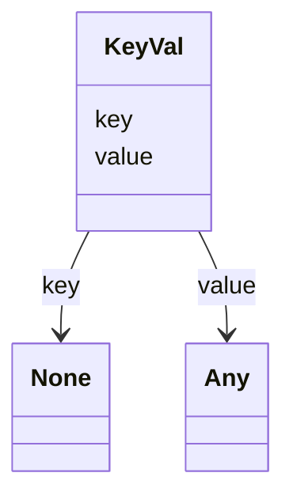

# Class: KeyVal


URI: [linkmltr:KeyVal](https://w3id.org/linkml/transformer/KeyVal)





<!-- no inheritance hierarchy -->


## Slots

| Name | Cardinality and Range | Description | Inheritance |
| ---  | --- | --- | --- |
| [key](key.md) | 0..1 <br/> [String](String.md) |  | direct |
| [value](value.md) | 0..1 <br/> [Any](Any.md) |  | direct |


## Usages

| used by | used in | type | used |
| ---  | --- | --- | --- |
| [TransformationSpecification](TransformationSpecification.md) | [prefixes](prefixes.md) | range | [KeyVal](KeyVal.md) |
| [ElementDerivation](ElementDerivation.md) | [value_mappings](value_mappings.md) | range | [KeyVal](KeyVal.md) |
| [ElementDerivation](ElementDerivation.md) | [expression_to_value_mappings](expression_to_value_mappings.md) | range | [KeyVal](KeyVal.md) |
| [ElementDerivation](ElementDerivation.md) | [expression_to_expression_mappings](expression_to_expression_mappings.md) | range | [KeyVal](KeyVal.md) |
| [ClassDerivation](ClassDerivation.md) | [value_mappings](value_mappings.md) | range | [KeyVal](KeyVal.md) |
| [ClassDerivation](ClassDerivation.md) | [expression_to_value_mappings](expression_to_value_mappings.md) | range | [KeyVal](KeyVal.md) |
| [ClassDerivation](ClassDerivation.md) | [expression_to_expression_mappings](expression_to_expression_mappings.md) | range | [KeyVal](KeyVal.md) |
| [SlotDerivation](SlotDerivation.md) | [value_mappings](value_mappings.md) | range | [KeyVal](KeyVal.md) |
| [SlotDerivation](SlotDerivation.md) | [expression_to_value_mappings](expression_to_value_mappings.md) | range | [KeyVal](KeyVal.md) |
| [SlotDerivation](SlotDerivation.md) | [expression_to_expression_mappings](expression_to_expression_mappings.md) | range | [KeyVal](KeyVal.md) |
| [EnumDerivation](EnumDerivation.md) | [value_mappings](value_mappings.md) | range | [KeyVal](KeyVal.md) |
| [EnumDerivation](EnumDerivation.md) | [expression_to_value_mappings](expression_to_value_mappings.md) | range | [KeyVal](KeyVal.md) |
| [EnumDerivation](EnumDerivation.md) | [expression_to_expression_mappings](expression_to_expression_mappings.md) | range | [KeyVal](KeyVal.md) |
| [PermissibleValueDerivation](PermissibleValueDerivation.md) | [value_mappings](value_mappings.md) | range | [KeyVal](KeyVal.md) |
| [PermissibleValueDerivation](PermissibleValueDerivation.md) | [expression_to_value_mappings](expression_to_value_mappings.md) | range | [KeyVal](KeyVal.md) |
| [PermissibleValueDerivation](PermissibleValueDerivation.md) | [expression_to_expression_mappings](expression_to_expression_mappings.md) | range | [KeyVal](KeyVal.md) |
| [PrefixDerivation](PrefixDerivation.md) | [value_mappings](value_mappings.md) | range | [KeyVal](KeyVal.md) |
| [PrefixDerivation](PrefixDerivation.md) | [expression_to_value_mappings](expression_to_value_mappings.md) | range | [KeyVal](KeyVal.md) |
| [PrefixDerivation](PrefixDerivation.md) | [expression_to_expression_mappings](expression_to_expression_mappings.md) | range | [KeyVal](KeyVal.md) |


## Identifier and Mapping Information


### Schema Source


* from schema: https://w3id.org/linkml/transformer


## Mappings

| Mapping Type | Mapped Value |
| ---  | ---  |
| self | linkmltr:KeyVal |
| native | linkmltr:KeyVal |


## LinkML Source

<!-- TODO: investigate https://stackoverflow.com/questions/37606292/how-to-create-tabbed-code-blocks-in-mkdocs-or-sphinx -->

### Direct

<details>
```yaml
name: KeyVal
from_schema: https://w3id.org/linkml/transformer
attributes:
  key:
    name: key
    from_schema: https://w3id.org/linkml/transformer
    rank: 1000
    key: true
    domain_of:
    - KeyVal
    required: true
  value:
    name: value
    from_schema: https://w3id.org/linkml/transformer
    rank: 1000
    domain_of:
    - KeyVal
    range: Any

```
</details>

### Induced

<details>
```yaml
name: KeyVal
from_schema: https://w3id.org/linkml/transformer
attributes:
  key:
    name: key
    from_schema: https://w3id.org/linkml/transformer
    rank: 1000
    key: true
    alias: key
    owner: KeyVal
    domain_of:
    - KeyVal
    required: true
  value:
    name: value
    from_schema: https://w3id.org/linkml/transformer
    rank: 1000
    alias: value
    owner: KeyVal
    domain_of:
    - KeyVal
    range: Any

```
</details>