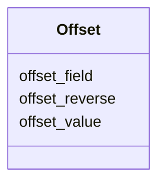

---
search:
  boost: 10.0
---

# Class: Offset 


_Configuration for calculating a value by applying an offset to a baseline value. The baseline value comes from the slot's populated_from field. This is commonly used for longitudinal data where measurements are recorded relative to a baseline. For example, calculating age_at_visit from age + (days * 1/365)._

_The calculation is: result = baseline ± (offset_value * offset_field_value) where baseline comes from populated_from._


<div data-search-exclude markdown="1">


URI: [linkmlmap:Offset](https://w3id.org/linkml/transformer/Offset)





<!-- no inheritance hierarchy -->

## Slots

| Name | Cardinality and Range | Description | Inheritance |
| ---  | --- | --- | --- |
| [offset_value](offset_value.md) | 1 <br/> [Float](Float.md) | Multiplier applied to the offset field value | direct |
| [offset_field](offset_field.md) | 1 <br/> [String](String.md) | Name of the field in the source object that contains the offset amount | direct |
| [offset_reverse](offset_reverse.md) | 0..1 <br/> [Boolean](Boolean.md) | If true, subtract the offset from the baseline (baseline - offset) | direct |


## Usages

| used by | used in | type | used |
| ---  | --- | --- | --- |
| [SlotDerivation](SlotDerivation.md) | [offset](offset.md) | range | [Offset](Offset.md) |


## Identifier and Mapping Information


### Schema Source


* from schema: https://w3id.org/linkml/transformer


## Mappings

| Mapping Type | Mapped Value |
| ---  | ---  |
| self | linkmlmap:Offset |
| native | linkmlmap:Offset |


## LinkML Source

<!-- TODO: investigate https://stackoverflow.com/questions/37606292/how-to-create-tabbed-code-blocks-in-mkdocs-or-sphinx -->

### Direct

<details>
```yaml
name: Offset
description: 'Configuration for calculating a value by applying an offset to a baseline
  value. The baseline value comes from the slot''s populated_from field. This is commonly
  used for longitudinal data where measurements are recorded relative to a baseline.
  For example, calculating age_at_visit from age + (days * 1/365).

  The calculation is: result = baseline ± (offset_value * offset_field_value) where
  baseline comes from populated_from.'
from_schema: https://w3id.org/linkml/transformer
attributes:
  offset_value:
    name: offset_value
    description: Multiplier applied to the offset field value. For example, use 1/365
      (or 0.00273973) to convert days to years, or 1/12 (or 0.0833333) to convert
      months to years.
    from_schema: https://w3id.org/linkml/transformer
    rank: 1000
    domain_of:
    - Offset
    range: float
    required: true
  offset_field:
    name: offset_field
    description: Name of the field in the source object that contains the offset amount.
      This value will be multiplied by offset_value.
    from_schema: https://w3id.org/linkml/transformer
    rank: 1000
    domain_of:
    - Offset
    range: string
    required: true
  offset_reverse:
    name: offset_reverse
    description: If true, subtract the offset from the baseline (baseline - offset).
      If false, add the offset to the baseline (baseline + offset). Defaults to false
      (addition).
    from_schema: https://w3id.org/linkml/transformer
    rank: 1000
    domain_of:
    - Offset
    range: boolean

```
</details>

### Induced

<details>
```yaml
name: Offset
description: 'Configuration for calculating a value by applying an offset to a baseline
  value. The baseline value comes from the slot''s populated_from field. This is commonly
  used for longitudinal data where measurements are recorded relative to a baseline.
  For example, calculating age_at_visit from age + (days * 1/365).

  The calculation is: result = baseline ± (offset_value * offset_field_value) where
  baseline comes from populated_from.'
from_schema: https://w3id.org/linkml/transformer
attributes:
  offset_value:
    name: offset_value
    description: Multiplier applied to the offset field value. For example, use 1/365
      (or 0.00273973) to convert days to years, or 1/12 (or 0.0833333) to convert
      months to years.
    from_schema: https://w3id.org/linkml/transformer
    rank: 1000
    owner: Offset
    domain_of:
    - Offset
    range: float
    required: true
  offset_field:
    name: offset_field
    description: Name of the field in the source object that contains the offset amount.
      This value will be multiplied by offset_value.
    from_schema: https://w3id.org/linkml/transformer
    rank: 1000
    owner: Offset
    domain_of:
    - Offset
    range: string
    required: true
  offset_reverse:
    name: offset_reverse
    description: If true, subtract the offset from the baseline (baseline - offset).
      If false, add the offset to the baseline (baseline + offset). Defaults to false
      (addition).
    from_schema: https://w3id.org/linkml/transformer
    rank: 1000
    owner: Offset
    domain_of:
    - Offset
    range: boolean

```
</details></div>