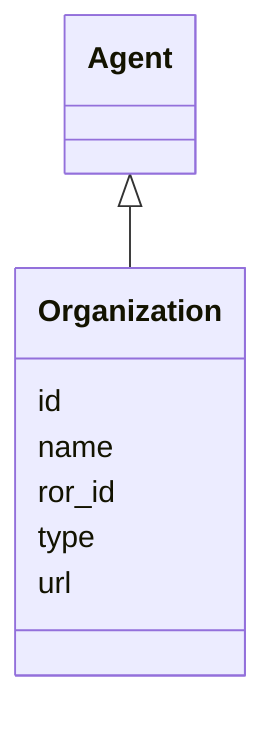

---
search:
  boost: 10.0
---

# Class: Organization 


_An organization or institution that contributes to a mapping specification_


<div data-search-exclude markdown="1">


URI: [linkmlmap:Organization](https://w3id.org/linkml/transformer/Organization)





## Inheritance
* [Agent](Agent.md)
    * **Organization**


## Slots

| Name | Cardinality and Range | Description | Inheritance |
| ---  | --- | --- | --- |
| [ror_id](ror_id.md) | 0..1 <br/> [Uriorcurie](Uriorcurie.md) | ROR (Research Organization Registry) identifier | direct |
| [url](url.md) | 0..1 <br/> [Uri](Uri.md) | URL or web address of the organization | direct |
| [id](id.md) | 1 <br/> [Uriorcurie](Uriorcurie.md) | Identifier for the agent | [Agent](Agent.md) |
| [name](name.md) | 0..1 <br/> [String](String.md) | Name of the agent | [Agent](Agent.md) |
| [type](type.md) | 0..1 <br/> [String](String.md) | Type of the agent | [Agent](Agent.md) |


## Identifier and Mapping Information


### Schema Source


* from schema: https://w3id.org/linkml/transformer


## Mappings

| Mapping Type | Mapped Value |
| ---  | ---  |
| self | linkmlmap:Organization |
| native | linkmlmap:Organization |


## LinkML Source

<!-- TODO: investigate https://stackoverflow.com/questions/37606292/how-to-create-tabbed-code-blocks-in-mkdocs-or-sphinx -->

### Direct

<details>
```yaml
name: Organization
description: An organization or institution that contributes to a mapping specification
from_schema: https://w3id.org/linkml/transformer
is_a: Agent
attributes:
  ror_id:
    name: ror_id
    description: ROR (Research Organization Registry) identifier
    from_schema: https://w3id.org/linkml/transformer
    rank: 1000
    domain_of:
    - Organization
    range: uriorcurie
  url:
    name: url
    description: URL or web address of the organization
    from_schema: https://w3id.org/linkml/transformer
    rank: 1000
    domain_of:
    - Organization
    range: uri

```
</details>

### Induced

<details>
```yaml
name: Organization
description: An organization or institution that contributes to a mapping specification
from_schema: https://w3id.org/linkml/transformer
is_a: Agent
attributes:
  ror_id:
    name: ror_id
    description: ROR (Research Organization Registry) identifier
    from_schema: https://w3id.org/linkml/transformer
    rank: 1000
    owner: Organization
    domain_of:
    - Organization
    range: uriorcurie
  url:
    name: url
    description: URL or web address of the organization
    from_schema: https://w3id.org/linkml/transformer
    rank: 1000
    owner: Organization
    domain_of:
    - Organization
    range: uri
  id:
    name: id
    description: Identifier for the agent
    from_schema: https://w3id.org/linkml/transformer
    identifier: true
    owner: Organization
    domain_of:
    - TransformationSpecification
    - Agent
    range: uriorcurie
    required: true
  name:
    name: name
    description: Name of the agent
    from_schema: https://w3id.org/linkml/transformer
    slot_uri: schema:name
    owner: Organization
    domain_of:
    - SchemaReference
    - ElementDerivation
    - ObjectDerivation
    - SlotDerivation
    - EnumDerivation
    - PermissibleValueDerivation
    - Agent
    range: string
  type:
    name: type
    description: Type of the agent
    from_schema: https://w3id.org/linkml/transformer
    rank: 1000
    designates_type: true
    owner: Organization
    domain_of:
    - Agent
    range: string

```
</details></div>