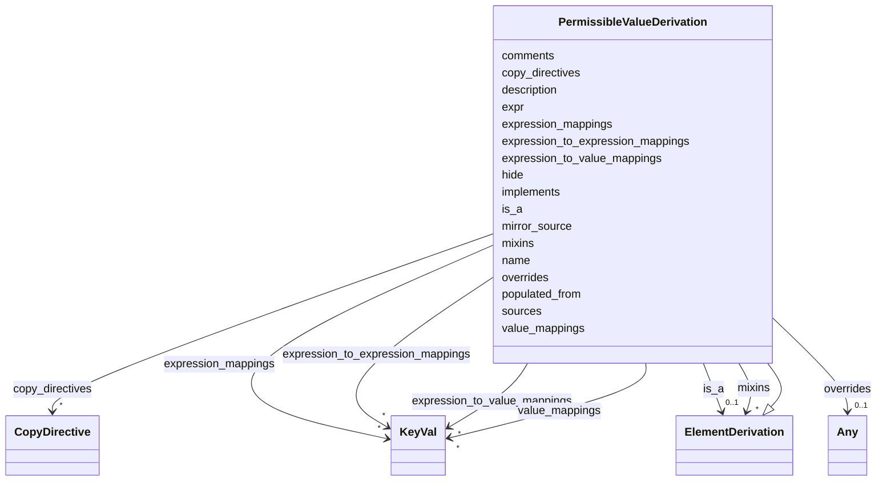

---
search:
  boost: 10.0
---

# Class: PermissibleValueDerivation 


_A specification of how to derive the value of a PV from a source enum_


<div data-search-exclude markdown="1">


URI: [linkmlmap:PermissibleValueDerivation](https://w3id.org/linkml/transformer/PermissibleValueDerivation)





## Inheritance
* [SpecificationComponent](SpecificationComponent.md)
    * [ElementDerivation](ElementDerivation.md)
        * **PermissibleValueDerivation**


## Slots

| Name | Cardinality and Range | Description | Inheritance |
| ---  | --- | --- | --- |
| [name](name.md) | 1 <br/> [String](String.md) | Target permissible value text | direct |
| [expr](expr.md) | 0..1 <br/> [String](String.md) | An expression evaluated on the source object to derive this permissible value | direct |
| [populated_from](populated_from.md) | * <br/> [String](String.md) | Source permissible value(s) that map to this target permissible value | direct |
| [sources](sources.md) | * <br/> [String](String.md) | Deprecated | direct |
| [hide](hide.md) | 0..1 <br/> [Boolean](Boolean.md) | True if this is suppressed | direct |
| [copy_directives](copy_directives.md) | * <br/> [CopyDirective](CopyDirective.md) | Directives controlling which sub-elements of the source element are copied in... | [ElementDerivation](ElementDerivation.md) |
| [overrides](overrides.md) | 0..1 <br/> [Any](Any.md) | overrides source schema slots | [ElementDerivation](ElementDerivation.md) |
| [is_a](is_a.md) | 0..1 <br/> [ElementDerivation](ElementDerivation.md) | The parent element that the derived target element inherits from | [ElementDerivation](ElementDerivation.md) |
| [mixins](mixins.md) | * <br/> [ElementDerivation](ElementDerivation.md) | Mixin elements applied to the derived target element | [ElementDerivation](ElementDerivation.md) |
| [value_mappings](value_mappings.md) | * <br/> [KeyVal](KeyVal.md) | A mapping table that is applied directly to mappings, in order of precedence | [ElementDerivation](ElementDerivation.md) |
| [expression_mappings](expression_mappings.md) | * <br/> [KeyVal](KeyVal.md) | A mapping table where the values are expressions evaluated against source bin... | [ElementDerivation](ElementDerivation.md) |
| [expression_to_value_mappings](expression_to_value_mappings.md) | * <br/> [KeyVal](KeyVal.md) | A mapping table in which the keys are boolean expressions and the values are ... | [ElementDerivation](ElementDerivation.md) |
| [expression_to_expression_mappings](expression_to_expression_mappings.md) | * <br/> [KeyVal](KeyVal.md) | A mapping table in which the keys and values are expressions | [ElementDerivation](ElementDerivation.md) |
| [mirror_source](mirror_source.md) | 0..1 <br/> [Boolean](Boolean.md) | If true, pass the source value through unchanged instead of transforming it | [ElementDerivation](ElementDerivation.md) |
| [description](description.md) | 0..1 <br/> [String](String.md) | description of the specification component | [SpecificationComponent](SpecificationComponent.md) |
| [implements](implements.md) | * <br/> [Uriorcurie](Uriorcurie.md) | A reference to a specification that this component implements | [SpecificationComponent](SpecificationComponent.md) |
| [comments](comments.md) | * <br/> [String](String.md) | A list of comments about this component | [SpecificationComponent](SpecificationComponent.md) |


## Usages

| used by | used in | type | used |
| ---  | --- | --- | --- |
| [EnumDerivation](EnumDerivation.md) | [permissible_value_derivations](permissible_value_derivations.md) | range | [PermissibleValueDerivation](PermissibleValueDerivation.md) |


## TODOs

* this is currently under-specified. We will need boolean combinators to express if-then-else


## Identifier and Mapping Information


### Schema Source


* from schema: https://w3id.org/linkml/transformer


## Mappings

| Mapping Type | Mapped Value |
| ---  | ---  |
| self | linkmlmap:PermissibleValueDerivation |
| native | linkmlmap:PermissibleValueDerivation |


## LinkML Source

<!-- TODO: investigate https://stackoverflow.com/questions/37606292/how-to-create-tabbed-code-blocks-in-mkdocs-or-sphinx -->

### Direct

<details>
```yaml
name: PermissibleValueDerivation
description: A specification of how to derive the value of a PV from a source enum
todos:
- this is currently under-specified. We will need boolean combinators to express if-then-else
from_schema: https://w3id.org/linkml/transformer
is_a: ElementDerivation
attributes:
  name:
    name: name
    description: Target permissible value text
    from_schema: https://w3id.org/linkml/transformer
    key: true
    domain_of:
    - SchemaReference
    - ElementDerivation
    - ObjectDerivation
    - SlotDerivation
    - EnumDerivation
    - PermissibleValueDerivation
    - Agent
  expr:
    name: expr
    description: An expression evaluated on the source object to derive this permissible
      value. Should be specified using the LinkML expression language.
    from_schema: https://w3id.org/linkml/transformer
    domain_of:
    - SlotDerivation
    - EnumDerivation
    - PermissibleValueDerivation
    range: string
  populated_from:
    name: populated_from
    description: Source permissible value(s) that map to this target permissible value.
      Accepts a single value or a list; scalar input is normalized to a one-element
      list at load time.
    from_schema: https://w3id.org/linkml/transformer
    domain_of:
    - ClassDerivation
    - SlotDerivation
    - EnumDerivation
    - PermissibleValueDerivation
    range: string
    multivalued: true
  sources:
    name: sources
    description: Deprecated. Use populated_from instead.
    deprecated: Deprecated. Use populated_from instead, which now accepts a list.
      See https://github.com/linkml/linkml-map/issues/193. Will be removed in a future
      version.
    from_schema: https://w3id.org/linkml/transformer
    domain_of:
    - ClassDerivation
    - SlotDerivation
    - EnumDerivation
    - PermissibleValueDerivation
    range: string
    multivalued: true
  hide:
    name: hide
    description: True if this is suppressed
    from_schema: https://w3id.org/linkml/transformer
    domain_of:
    - SlotDerivation
    - EnumDerivation
    - PermissibleValueDerivation
    range: boolean

```
</details>

### Induced

<details>
```yaml
name: PermissibleValueDerivation
description: A specification of how to derive the value of a PV from a source enum
todos:
- this is currently under-specified. We will need boolean combinators to express if-then-else
from_schema: https://w3id.org/linkml/transformer
is_a: ElementDerivation
attributes:
  name:
    name: name
    description: Target permissible value text
    from_schema: https://w3id.org/linkml/transformer
    key: true
    owner: PermissibleValueDerivation
    domain_of:
    - SchemaReference
    - ElementDerivation
    - ObjectDerivation
    - SlotDerivation
    - EnumDerivation
    - PermissibleValueDerivation
    - Agent
    required: true
  expr:
    name: expr
    description: An expression evaluated on the source object to derive this permissible
      value. Should be specified using the LinkML expression language.
    from_schema: https://w3id.org/linkml/transformer
    owner: PermissibleValueDerivation
    domain_of:
    - SlotDerivation
    - EnumDerivation
    - PermissibleValueDerivation
    range: string
  populated_from:
    name: populated_from
    description: Source permissible value(s) that map to this target permissible value.
      Accepts a single value or a list; scalar input is normalized to a one-element
      list at load time.
    from_schema: https://w3id.org/linkml/transformer
    owner: PermissibleValueDerivation
    domain_of:
    - ClassDerivation
    - SlotDerivation
    - EnumDerivation
    - PermissibleValueDerivation
    range: string
    multivalued: true
  sources:
    name: sources
    description: Deprecated. Use populated_from instead.
    deprecated: Deprecated. Use populated_from instead, which now accepts a list.
      See https://github.com/linkml/linkml-map/issues/193. Will be removed in a future
      version.
    from_schema: https://w3id.org/linkml/transformer
    owner: PermissibleValueDerivation
    domain_of:
    - ClassDerivation
    - SlotDerivation
    - EnumDerivation
    - PermissibleValueDerivation
    range: string
    multivalued: true
  hide:
    name: hide
    description: True if this is suppressed
    from_schema: https://w3id.org/linkml/transformer
    owner: PermissibleValueDerivation
    domain_of:
    - SlotDerivation
    - EnumDerivation
    - PermissibleValueDerivation
    range: boolean
  copy_directives:
    name: copy_directives
    description: Directives controlling which sub-elements of the source element are
      copied into the derived target element.
    from_schema: https://w3id.org/linkml/transformer
    owner: PermissibleValueDerivation
    domain_of:
    - TransformationSpecification
    - ElementDerivation
    range: CopyDirective
    multivalued: true
    inlined: true
  overrides:
    name: overrides
    description: overrides source schema slots
    from_schema: https://w3id.org/linkml/transformer
    rank: 1000
    owner: PermissibleValueDerivation
    domain_of:
    - ElementDerivation
    range: Any
  is_a:
    name: is_a
    description: The parent element that the derived target element inherits from.
    from_schema: https://w3id.org/linkml/transformer
    rank: 1000
    slot_uri: linkml:is_a
    owner: PermissibleValueDerivation
    domain_of:
    - ElementDerivation
    range: ElementDerivation
  mixins:
    name: mixins
    description: Mixin elements applied to the derived target element.
    from_schema: https://w3id.org/linkml/transformer
    rank: 1000
    slot_uri: linkml:mixins
    owner: PermissibleValueDerivation
    domain_of:
    - ElementDerivation
    range: ElementDerivation
    multivalued: true
    inlined: false
  value_mappings:
    name: value_mappings
    description: A mapping table that is applied directly to mappings, in order of
      precedence. Keys should always be quoted in YAML to prevent type coercion —
      unquoted true/false become booleans and bare numbers become integers, which
      will not match the stringified source value used for lookup.
    from_schema: https://w3id.org/linkml/transformer
    rank: 1000
    owner: PermissibleValueDerivation
    domain_of:
    - ElementDerivation
    range: KeyVal
    multivalued: true
    inlined: true
  expression_mappings:
    name: expression_mappings
    description: A mapping table where the values are expressions evaluated against
      source bindings. Looked up by the same key as value_mappings (the stringified
      source value). Keys should always be quoted (see value_mappings). If both value_mappings
      and expression_mappings are present, value_mappings takes precedence for keys
      that appear in both.
    from_schema: https://w3id.org/linkml/transformer
    rank: 1000
    owner: PermissibleValueDerivation
    domain_of:
    - ElementDerivation
    range: KeyVal
    multivalued: true
    inlined: true
  expression_to_value_mappings:
    name: expression_to_value_mappings
    description: 'A mapping table in which the keys are boolean expressions and the
      values are literal results. On enum derivations, used for scalar binning: each
      key is evaluated with value() bound to the incoming value, and the first truthy
      key''s value is returned as the target permissible value. See issue #99.'
    from_schema: https://w3id.org/linkml/transformer
    rank: 1000
    owner: PermissibleValueDerivation
    domain_of:
    - ElementDerivation
    range: KeyVal
    multivalued: true
    inlined: true
  expression_to_expression_mappings:
    name: expression_to_expression_mappings
    description: A mapping table in which the keys and values are expressions
    deprecated: 'Deprecated: use case() with and/or operators instead (#127). Will
      be removed before 1.0.'
    from_schema: https://w3id.org/linkml/transformer
    rank: 1000
    owner: PermissibleValueDerivation
    domain_of:
    - ElementDerivation
    range: KeyVal
    multivalued: true
    inlined: true
  mirror_source:
    name: mirror_source
    description: If true, pass the source value through unchanged instead of transforming
      it.
    from_schema: https://w3id.org/linkml/transformer
    rank: 1000
    owner: PermissibleValueDerivation
    domain_of:
    - ElementDerivation
    range: boolean
  description:
    name: description
    description: description of the specification component
    from_schema: https://w3id.org/linkml/transformer
    rank: 1000
    slot_uri: dcterms:description
    owner: PermissibleValueDerivation
    domain_of:
    - SpecificationComponent
    range: string
  implements:
    name: implements
    description: A reference to a specification that this component implements.
    from_schema: https://w3id.org/linkml/transformer
    rank: 1000
    owner: PermissibleValueDerivation
    domain_of:
    - SpecificationComponent
    range: uriorcurie
    multivalued: true
  comments:
    name: comments
    description: A list of comments about this component. Comments are free text,
      and may be used to provide additional information about the component, including
      instructions for its use.
    from_schema: https://w3id.org/linkml/transformer
    rank: 1000
    slot_uri: rdfs:comment
    owner: PermissibleValueDerivation
    domain_of:
    - SpecificationComponent
    range: string
    multivalued: true

```
</details></div>