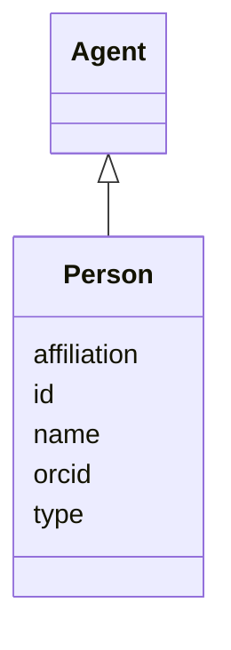

---
search:
  boost: 10.0
---

# Class: Person 


_An individual person who contributes to a mapping specification_


<div data-search-exclude markdown="1">


URI: [linkmlmap:Person](https://w3id.org/linkml/transformer/Person)





## Inheritance
* [Agent](Agent.md)
    * **Person**


## Slots

| Name | Cardinality and Range | Description | Inheritance |
| ---  | --- | --- | --- |
| [orcid](orcid.md) | 0..1 <br/> [Uriorcurie](Uriorcurie.md) | ORCID identifier for the person | direct |
| [affiliation](affiliation.md) | 0..1 <br/> [String](String.md) | Institutional affiliation of the person | direct |
| [id](id.md) | 1 <br/> [Uriorcurie](Uriorcurie.md) | Identifier for the agent | [Agent](Agent.md) |
| [name](name.md) | 0..1 <br/> [String](String.md) | Name of the agent | [Agent](Agent.md) |
| [type](type.md) | 0..1 <br/> [String](String.md) | Type of the agent | [Agent](Agent.md) |


## Identifier and Mapping Information


### Schema Source


* from schema: https://w3id.org/linkml/transformer


## Mappings

| Mapping Type | Mapped Value |
| ---  | ---  |
| self | linkmlmap:Person |
| native | linkmlmap:Person |


## LinkML Source

<!-- TODO: investigate https://stackoverflow.com/questions/37606292/how-to-create-tabbed-code-blocks-in-mkdocs-or-sphinx -->

### Direct

<details>
```yaml
name: Person
description: An individual person who contributes to a mapping specification
from_schema: https://w3id.org/linkml/transformer
is_a: Agent
attributes:
  orcid:
    name: orcid
    description: ORCID identifier for the person
    from_schema: https://w3id.org/linkml/transformer
    rank: 1000
    domain_of:
    - Person
    range: uriorcurie
  affiliation:
    name: affiliation
    description: Institutional affiliation of the person
    from_schema: https://w3id.org/linkml/transformer
    rank: 1000
    domain_of:
    - Person
    range: string

```
</details>

### Induced

<details>
```yaml
name: Person
description: An individual person who contributes to a mapping specification
from_schema: https://w3id.org/linkml/transformer
is_a: Agent
attributes:
  orcid:
    name: orcid
    description: ORCID identifier for the person
    from_schema: https://w3id.org/linkml/transformer
    rank: 1000
    owner: Person
    domain_of:
    - Person
    range: uriorcurie
  affiliation:
    name: affiliation
    description: Institutional affiliation of the person
    from_schema: https://w3id.org/linkml/transformer
    rank: 1000
    owner: Person
    domain_of:
    - Person
    range: string
  id:
    name: id
    description: Identifier for the agent
    from_schema: https://w3id.org/linkml/transformer
    identifier: true
    owner: Person
    domain_of:
    - TransformationSpecification
    - Agent
    range: uriorcurie
    required: true
  name:
    name: name
    description: Name of the agent
    from_schema: https://w3id.org/linkml/transformer
    slot_uri: schema:name
    owner: Person
    domain_of:
    - SchemaReference
    - ElementDerivation
    - ObjectDerivation
    - SlotDerivation
    - EnumDerivation
    - PermissibleValueDerivation
    - Agent
    range: string
  type:
    name: type
    description: Type of the agent
    from_schema: https://w3id.org/linkml/transformer
    rank: 1000
    designates_type: true
    owner: Person
    domain_of:
    - Agent
    range: string

```
</details></div>