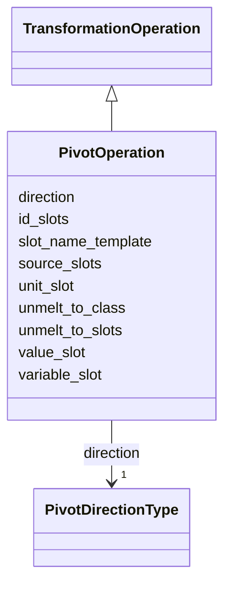

---
search:
  boost: 10.0
---

# Class: PivotOperation 

<div data-search-exclude markdown="1">


URI: [linkmlmap:PivotOperation](https://w3id.org/linkml/transformer/PivotOperation)





## Inheritance
* [TransformationOperation](TransformationOperation.md)
    * **PivotOperation**


## Slots

| Name | Cardinality and Range | Description | Inheritance |
| ---  | --- | --- | --- |
| [direction](direction.md) | 1 <br/> [PivotDirectionType](PivotDirectionType.md) |  | direct |
| [variable_slot](variable_slot.md) | 0..1 <br/> [SlotReference](SlotReference.md) | Slot to use for the variable column in the melted/long representation | direct |
| [value_slot](value_slot.md) | 0..1 <br/> [SlotReference](SlotReference.md) | Slot to use for the value column in the melted/long representation | direct |
| [unmelt_to_class](unmelt_to_class.md) | 0..1 <br/> [ClassReference](ClassReference.md) | In an unmelt operation, attributes (which are values in the long/melted/EAV r... | direct |
| [unmelt_to_slots](unmelt_to_slots.md) | * <br/> [SlotReference](SlotReference.md) |  | direct |
| [unit_slot](unit_slot.md) | 0..1 <br/> [SlotReference](SlotReference.md) | Optional slot containing unit information for {variable}_{unit} naming | direct |
| [slot_name_template](slot_name_template.md) | 0..1 <br/> [String](String.md) | Template for generating target slot names | direct |
| [source_slots](source_slots.md) | * <br/> [SlotReference](SlotReference.md) | For MELT, the list of wide-format slots to melt | direct |
| [id_slots](id_slots.md) | * <br/> [SlotReference](SlotReference.md) | Slots that identify the entity (not pivoted) | direct |


## Usages

| used by | used in | type | used |
| ---  | --- | --- | --- |
| [ClassDerivation](ClassDerivation.md) | [pivot_operation](pivot_operation.md) | range | [PivotOperation](PivotOperation.md) |
| [SlotDerivation](SlotDerivation.md) | [pivot_operation](pivot_operation.md) | range | [PivotOperation](PivotOperation.md) |


## Aliases


* melt/unmelt
* reification/dereification


## Identifier and Mapping Information


### Schema Source


* from schema: https://w3id.org/linkml/transformer


## Mappings

| Mapping Type | Mapped Value |
| ---  | ---  |
| self | linkmlmap:PivotOperation |
| native | linkmlmap:PivotOperation |


## LinkML Source

<!-- TODO: investigate https://stackoverflow.com/questions/37606292/how-to-create-tabbed-code-blocks-in-mkdocs-or-sphinx -->

### Direct

<details>
```yaml
name: PivotOperation
from_schema: https://w3id.org/linkml/transformer
aliases:
- melt/unmelt
- reification/dereification
is_a: TransformationOperation
attributes:
  direction:
    name: direction
    from_schema: https://w3id.org/linkml/transformer
    rank: 1000
    domain_of:
    - PivotOperation
    range: PivotDirectionType
    required: true
  variable_slot:
    name: variable_slot
    description: Slot to use for the variable column in the melted/long representation.
      In EAV this is the name of the 'A' variable
    from_schema: https://w3id.org/linkml/transformer
    aliases:
    - var_name
    rank: 1000
    ifabsent: string(variable)
    domain_of:
    - PivotOperation
    range: SlotReference
  value_slot:
    name: value_slot
    description: Slot to use for the value column in the melted/long representation.
      In EAV this is the name of the 'V' variable
    from_schema: https://w3id.org/linkml/transformer
    aliases:
    - value_name
    rank: 1000
    ifabsent: string(value)
    domain_of:
    - PivotOperation
    range: SlotReference
  unmelt_to_class:
    name: unmelt_to_class
    description: In an unmelt operation, attributes (which are values in the long/melted/EAV
      representation) must conform to valid attributes in this class
    from_schema: https://w3id.org/linkml/transformer
    rank: 1000
    domain_of:
    - PivotOperation
    range: ClassReference
  unmelt_to_slots:
    name: unmelt_to_slots
    from_schema: https://w3id.org/linkml/transformer
    rank: 1000
    domain_of:
    - PivotOperation
    range: SlotReference
    multivalued: true
  unit_slot:
    name: unit_slot
    description: Optional slot containing unit information for {variable}_{unit} naming
    from_schema: https://w3id.org/linkml/transformer
    rank: 1000
    domain_of:
    - PivotOperation
    range: SlotReference
  slot_name_template:
    name: slot_name_template
    description: Template for generating target slot names. Supports {variable} and
      {unit}.
    from_schema: https://w3id.org/linkml/transformer
    rank: 1000
    ifabsent: string({variable})
    domain_of:
    - PivotOperation
    range: string
  source_slots:
    name: source_slots
    description: For MELT, the list of wide-format slots to melt
    from_schema: https://w3id.org/linkml/transformer
    rank: 1000
    domain_of:
    - PivotOperation
    range: SlotReference
    multivalued: true
  id_slots:
    name: id_slots
    description: Slots that identify the entity (not pivoted)
    from_schema: https://w3id.org/linkml/transformer
    rank: 1000
    domain_of:
    - PivotOperation
    range: SlotReference
    multivalued: true

```
</details>

### Induced

<details>
```yaml
name: PivotOperation
from_schema: https://w3id.org/linkml/transformer
aliases:
- melt/unmelt
- reification/dereification
is_a: TransformationOperation
attributes:
  direction:
    name: direction
    from_schema: https://w3id.org/linkml/transformer
    rank: 1000
    owner: PivotOperation
    domain_of:
    - PivotOperation
    range: PivotDirectionType
    required: true
  variable_slot:
    name: variable_slot
    description: Slot to use for the variable column in the melted/long representation.
      In EAV this is the name of the 'A' variable
    from_schema: https://w3id.org/linkml/transformer
    aliases:
    - var_name
    rank: 1000
    ifabsent: string(variable)
    owner: PivotOperation
    domain_of:
    - PivotOperation
    range: SlotReference
  value_slot:
    name: value_slot
    description: Slot to use for the value column in the melted/long representation.
      In EAV this is the name of the 'V' variable
    from_schema: https://w3id.org/linkml/transformer
    aliases:
    - value_name
    rank: 1000
    ifabsent: string(value)
    owner: PivotOperation
    domain_of:
    - PivotOperation
    range: SlotReference
  unmelt_to_class:
    name: unmelt_to_class
    description: In an unmelt operation, attributes (which are values in the long/melted/EAV
      representation) must conform to valid attributes in this class
    from_schema: https://w3id.org/linkml/transformer
    rank: 1000
    owner: PivotOperation
    domain_of:
    - PivotOperation
    range: ClassReference
  unmelt_to_slots:
    name: unmelt_to_slots
    from_schema: https://w3id.org/linkml/transformer
    rank: 1000
    owner: PivotOperation
    domain_of:
    - PivotOperation
    range: SlotReference
    multivalued: true
  unit_slot:
    name: unit_slot
    description: Optional slot containing unit information for {variable}_{unit} naming
    from_schema: https://w3id.org/linkml/transformer
    rank: 1000
    owner: PivotOperation
    domain_of:
    - PivotOperation
    range: SlotReference
  slot_name_template:
    name: slot_name_template
    description: Template for generating target slot names. Supports {variable} and
      {unit}.
    from_schema: https://w3id.org/linkml/transformer
    rank: 1000
    ifabsent: string({variable})
    owner: PivotOperation
    domain_of:
    - PivotOperation
    range: string
  source_slots:
    name: source_slots
    description: For MELT, the list of wide-format slots to melt
    from_schema: https://w3id.org/linkml/transformer
    rank: 1000
    owner: PivotOperation
    domain_of:
    - PivotOperation
    range: SlotReference
    multivalued: true
  id_slots:
    name: id_slots
    description: Slots that identify the entity (not pivoted)
    from_schema: https://w3id.org/linkml/transformer
    rank: 1000
    owner: PivotOperation
    domain_of:
    - PivotOperation
    range: SlotReference
    multivalued: true

```
</details></div>