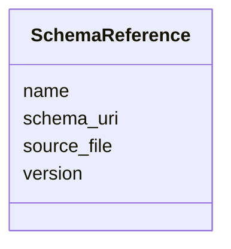

---
search:
  boost: 10.0
---

# Class: SchemaReference 


_A reference to a LinkML schema, with optional version and locator metadata. Used by `source_schema` and `target_schema` on `TransformationSpecification`._


<div data-search-exclude markdown="1">


URI: [linkmlmap:SchemaReference](https://w3id.org/linkml/transformer/SchemaReference)





<!-- no inheritance hierarchy -->

## Slots

| Name | Cardinality and Range | Description | Inheritance |
| ---  | --- | --- | --- |
| [name](name.md) | 1 <br/> [String](String.md) | The name or identifier of the schema | direct |
| [version](version.md) | 0..1 <br/> [String](String.md) | Version string for the schema (e | direct |
| [schema_uri](schema_uri.md) | 0..1 <br/> [Uri](Uri.md) | The URI/IRI identifier of the schema (matches the schema's `id`) | direct |
| [source_file](source_file.md) | 0..1 <br/> [String](String.md) | Optional file path or URL from which the schema can be loaded | direct |


## Usages

| used by | used in | type | used |
| ---  | --- | --- | --- |
| [TransformationSpecification](TransformationSpecification.md) | [source_schema](source_schema.md) | range | [SchemaReference](SchemaReference.md) |
| [TransformationSpecification](TransformationSpecification.md) | [target_schema](target_schema.md) | range | [SchemaReference](SchemaReference.md) |


## Identifier and Mapping Information


### Schema Source


* from schema: https://w3id.org/linkml/transformer


## Mappings

| Mapping Type | Mapped Value |
| ---  | ---  |
| self | linkmlmap:SchemaReference |
| native | linkmlmap:SchemaReference |


## LinkML Source

<!-- TODO: investigate https://stackoverflow.com/questions/37606292/how-to-create-tabbed-code-blocks-in-mkdocs-or-sphinx -->

### Direct

<details>
```yaml
name: SchemaReference
description: A reference to a LinkML schema, with optional version and locator metadata.
  Used by `source_schema` and `target_schema` on `TransformationSpecification`.
from_schema: https://w3id.org/linkml/transformer
attributes:
  name:
    name: name
    description: The name or identifier of the schema.
    from_schema: https://w3id.org/linkml/transformer
    rank: 1000
    domain_of:
    - SchemaReference
    - ElementDerivation
    - ObjectDerivation
    - SlotDerivation
    - EnumDerivation
    - PermissibleValueDerivation
    - Agent
    range: string
    required: true
  version:
    name: version
    description: Version string for the schema (e.g. semver or date-based).
    from_schema: https://w3id.org/linkml/transformer
    slot_uri: schema:version
    domain_of:
    - TransformationSpecification
    - SchemaReference
    - Software
    range: string
  schema_uri:
    name: schema_uri
    description: The URI/IRI identifier of the schema (matches the schema's `id`).
    from_schema: https://w3id.org/linkml/transformer
    rank: 1000
    domain_of:
    - SchemaReference
    range: uri
  source_file:
    name: source_file
    description: Optional file path or URL from which the schema can be loaded.
    from_schema: https://w3id.org/linkml/transformer
    rank: 1000
    domain_of:
    - SchemaReference
    range: string

```
</details>

### Induced

<details>
```yaml
name: SchemaReference
description: A reference to a LinkML schema, with optional version and locator metadata.
  Used by `source_schema` and `target_schema` on `TransformationSpecification`.
from_schema: https://w3id.org/linkml/transformer
attributes:
  name:
    name: name
    description: The name or identifier of the schema.
    from_schema: https://w3id.org/linkml/transformer
    rank: 1000
    owner: SchemaReference
    domain_of:
    - SchemaReference
    - ElementDerivation
    - ObjectDerivation
    - SlotDerivation
    - EnumDerivation
    - PermissibleValueDerivation
    - Agent
    range: string
    required: true
  version:
    name: version
    description: Version string for the schema (e.g. semver or date-based).
    from_schema: https://w3id.org/linkml/transformer
    slot_uri: schema:version
    owner: SchemaReference
    domain_of:
    - TransformationSpecification
    - SchemaReference
    - Software
    range: string
  schema_uri:
    name: schema_uri
    description: The URI/IRI identifier of the schema (matches the schema's `id`).
    from_schema: https://w3id.org/linkml/transformer
    rank: 1000
    owner: SchemaReference
    domain_of:
    - SchemaReference
    range: uri
  source_file:
    name: source_file
    description: Optional file path or URL from which the schema can be loaded.
    from_schema: https://w3id.org/linkml/transformer
    rank: 1000
    owner: SchemaReference
    domain_of:
    - SchemaReference
    range: string

```
</details></div>