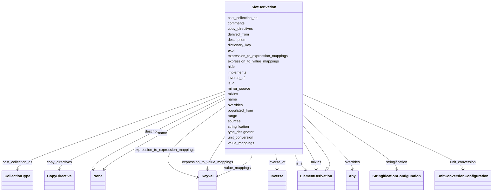

# Class: SlotDerivation


_A specification of how to derive the value of a target slot from a source slot_


URI: [linkmltr:SlotDerivation](https://w3id.org/linkml/transformer/SlotDerivation)





## Inheritance
* [SpecificationComponent](SpecificationComponent.md)
    * [ElementDerivation](ElementDerivation.md)
        * **SlotDerivation**


## Slots

| Name | Cardinality and Range | Description | Inheritance |
| ---  | --- | --- | --- |
| [name](name.md) | 0..1 <br/> [String](String.md) | Target slot name | direct |
| [populated_from](populated_from.md) | 0..1 <br/> [SlotReference](SlotReference.md) | Source slot name | direct |
| [sources](sources.md) | 0..* <br/> [SlotReference](SlotReference.md) |  | direct |
| [derived_from](derived_from.md) | 0..* <br/> [SlotReference](SlotReference.md) | Source slots that are used to derive this slot | direct |
| [expr](expr.md) | 0..1 <br/> [String](String.md) | An expression to be evaluated on the source object to derive the target slot | direct |
| [range](range.md) | 0..1 <br/> [String](String.md) |  | direct |
| [unit_conversion](unit_conversion.md) | 0..1 <br/> [UnitConversionConfiguration](UnitConversionConfiguration.md) |  | direct |
| [inverse_of](inverse_of.md) | 0..1 <br/> [Inverse](Inverse.md) | Used to specify a class-slot tuple that is the inverse of the derived/target ... | direct |
| [hide](hide.md) | 0..1 <br/> [Boolean](Boolean.md) | True if this is suppressed | direct |
| [type_designator](type_designator.md) | 0..1 <br/> [Boolean](Boolean.md) |  | direct |
| [cast_collection_as](cast_collection_as.md) | 0..1 <br/> [CollectionType](CollectionType.md) |  | direct |
| [dictionary_key](dictionary_key.md) | 0..1 <br/> [String](String.md) |  | direct |
| [stringification](stringification.md) | 0..1 <br/> [StringificationConfiguration](StringificationConfiguration.md) |  | direct |
| [copy_directives](copy_directives.md) | 0..* <br/> [CopyDirective](CopyDirective.md) |  | [ElementDerivation](ElementDerivation.md) |
| [overrides](overrides.md) | 0..1 <br/> [Any](Any.md) | overrides source schema slots | [ElementDerivation](ElementDerivation.md) |
| [is_a](is_a.md) | 0..1 <br/> [ElementDerivation](ElementDerivation.md) |  | [ElementDerivation](ElementDerivation.md) |
| [mixins](mixins.md) | 0..* <br/> [ElementDerivation](ElementDerivation.md) |  | [ElementDerivation](ElementDerivation.md) |
| [value_mappings](value_mappings.md) | 0..* <br/> [KeyVal](KeyVal.md) | A mapping table that is applied directly to mappings, in order of precedence | [ElementDerivation](ElementDerivation.md) |
| [expression_to_value_mappings](expression_to_value_mappings.md) | 0..* <br/> [KeyVal](KeyVal.md) | A mapping table in which the keys are expressions | [ElementDerivation](ElementDerivation.md) |
| [expression_to_expression_mappings](expression_to_expression_mappings.md) | 0..* <br/> [KeyVal](KeyVal.md) | A mapping table in which the keys and values are expressions | [ElementDerivation](ElementDerivation.md) |
| [mirror_source](mirror_source.md) | 0..1 <br/> [Boolean](Boolean.md) |  | [ElementDerivation](ElementDerivation.md) |
| [description](description.md) | 0..1 <br/> [String](String.md) | description of the specification component | [SpecificationComponent](SpecificationComponent.md) |
| [implements](implements.md) | 0..* <br/> [Uriorcurie](Uriorcurie.md) | A reference to a specification that this component implements | [SpecificationComponent](SpecificationComponent.md) |
| [comments](comments.md) | 0..* <br/> [String](String.md) | A list of comments about this component | [SpecificationComponent](SpecificationComponent.md) |


## Usages

| used by | used in | type | used |
| ---  | --- | --- | --- |
| [TransformationSpecification](TransformationSpecification.md) | [slot_derivations](slot_derivations.md) | range | [SlotDerivation](SlotDerivation.md) |
| [ClassDerivation](ClassDerivation.md) | [slot_derivations](slot_derivations.md) | range | [SlotDerivation](SlotDerivation.md) |


## Identifier and Mapping Information


### Schema Source


* from schema: https://w3id.org/linkml/transformer


## Mappings

| Mapping Type | Mapped Value |
| ---  | ---  |
| self | linkmltr:SlotDerivation |
| native | linkmltr:SlotDerivation |


## LinkML Source

<!-- TODO: investigate https://stackoverflow.com/questions/37606292/how-to-create-tabbed-code-blocks-in-mkdocs-or-sphinx -->

### Direct

<details>
```yaml
name: SlotDerivation
description: A specification of how to derive the value of a target slot from a source
  slot
from_schema: https://w3id.org/linkml/transformer
is_a: ElementDerivation
attributes:
  name:
    name: name
    description: Target slot name
    from_schema: https://w3id.org/linkml/transformer
    key: true
    domain_of:
    - ElementDerivation
    - SlotDerivation
    - EnumDerivation
    - PermissibleValueDerivation
    required: true
  populated_from:
    name: populated_from
    description: Source slot name
    from_schema: https://w3id.org/linkml/transformer
    domain_of:
    - ClassDerivation
    - SlotDerivation
    - EnumDerivation
    - PermissibleValueDerivation
    range: SlotReference
  sources:
    name: sources
    from_schema: https://w3id.org/linkml/transformer
    multivalued: true
    domain_of:
    - ClassDerivation
    - SlotDerivation
    - EnumDerivation
    - PermissibleValueDerivation
    range: SlotReference
  derived_from:
    name: derived_from
    description: Source slots that are used to derive this slot. This can be computed
      from the expr, if the expr is declarative.
    from_schema: https://w3id.org/linkml/transformer
    rank: 1000
    multivalued: true
    domain_of:
    - SlotDerivation
    range: SlotReference
  expr:
    name: expr
    description: An expression to be evaluated on the source object to derive the
      target slot. Should be specified using the LinkML expression language.
    from_schema: https://w3id.org/linkml/transformer
    rank: 1000
    domain_of:
    - SlotDerivation
    - EnumDerivation
    - PermissibleValueDerivation
    range: string
  range:
    name: range
    from_schema: https://w3id.org/linkml/transformer
    rank: 1000
    slot_uri: linkml:range
    domain_of:
    - SlotDerivation
    range: string
  unit_conversion:
    name: unit_conversion
    from_schema: https://w3id.org/linkml/transformer
    rank: 1000
    domain_of:
    - SlotDerivation
    range: UnitConversionConfiguration
  inverse_of:
    name: inverse_of
    description: Used to specify a class-slot tuple that is the inverse of the derived/target
      slot. This is used primarily for mapping to relational databases or formalisms
      that do not allow multiple values. The class representing the repeated element
      has a foreign key slot inserted in that 'back references' the original multivalued
      slot.
    from_schema: https://w3id.org/linkml/transformer
    rank: 1000
    domain_of:
    - SlotDerivation
    range: Inverse
  hide:
    name: hide
    description: True if this is suppressed
    from_schema: https://w3id.org/linkml/transformer
    rank: 1000
    domain_of:
    - SlotDerivation
    - EnumDerivation
    - PermissibleValueDerivation
    range: boolean
  type_designator:
    name: type_designator
    from_schema: https://w3id.org/linkml/transformer
    rank: 1000
    domain_of:
    - SlotDerivation
    range: boolean
  cast_collection_as:
    name: cast_collection_as
    from_schema: https://w3id.org/linkml/transformer
    rank: 1000
    domain_of:
    - SlotDerivation
    range: CollectionType
  dictionary_key:
    name: dictionary_key
    from_schema: https://w3id.org/linkml/transformer
    rank: 1000
    domain_of:
    - SlotDerivation
    range: string
  stringification:
    name: stringification
    from_schema: https://w3id.org/linkml/transformer
    rank: 1000
    domain_of:
    - SlotDerivation
    range: StringificationConfiguration

```
</details>

### Induced

<details>
```yaml
name: SlotDerivation
description: A specification of how to derive the value of a target slot from a source
  slot
from_schema: https://w3id.org/linkml/transformer
is_a: ElementDerivation
attributes:
  name:
    name: name
    description: Target slot name
    from_schema: https://w3id.org/linkml/transformer
    key: true
    alias: name
    owner: SlotDerivation
    domain_of:
    - ElementDerivation
    - SlotDerivation
    - EnumDerivation
    - PermissibleValueDerivation
    required: true
  populated_from:
    name: populated_from
    description: Source slot name
    from_schema: https://w3id.org/linkml/transformer
    alias: populated_from
    owner: SlotDerivation
    domain_of:
    - ClassDerivation
    - SlotDerivation
    - EnumDerivation
    - PermissibleValueDerivation
    range: SlotReference
  sources:
    name: sources
    from_schema: https://w3id.org/linkml/transformer
    multivalued: true
    alias: sources
    owner: SlotDerivation
    domain_of:
    - ClassDerivation
    - SlotDerivation
    - EnumDerivation
    - PermissibleValueDerivation
    range: SlotReference
  derived_from:
    name: derived_from
    description: Source slots that are used to derive this slot. This can be computed
      from the expr, if the expr is declarative.
    from_schema: https://w3id.org/linkml/transformer
    rank: 1000
    multivalued: true
    alias: derived_from
    owner: SlotDerivation
    domain_of:
    - SlotDerivation
    range: SlotReference
  expr:
    name: expr
    description: An expression to be evaluated on the source object to derive the
      target slot. Should be specified using the LinkML expression language.
    from_schema: https://w3id.org/linkml/transformer
    rank: 1000
    alias: expr
    owner: SlotDerivation
    domain_of:
    - SlotDerivation
    - EnumDerivation
    - PermissibleValueDerivation
    range: string
  range:
    name: range
    from_schema: https://w3id.org/linkml/transformer
    rank: 1000
    slot_uri: linkml:range
    alias: range
    owner: SlotDerivation
    domain_of:
    - SlotDerivation
    range: string
  unit_conversion:
    name: unit_conversion
    from_schema: https://w3id.org/linkml/transformer
    rank: 1000
    alias: unit_conversion
    owner: SlotDerivation
    domain_of:
    - SlotDerivation
    range: UnitConversionConfiguration
  inverse_of:
    name: inverse_of
    description: Used to specify a class-slot tuple that is the inverse of the derived/target
      slot. This is used primarily for mapping to relational databases or formalisms
      that do not allow multiple values. The class representing the repeated element
      has a foreign key slot inserted in that 'back references' the original multivalued
      slot.
    from_schema: https://w3id.org/linkml/transformer
    rank: 1000
    alias: inverse_of
    owner: SlotDerivation
    domain_of:
    - SlotDerivation
    range: Inverse
  hide:
    name: hide
    description: True if this is suppressed
    from_schema: https://w3id.org/linkml/transformer
    rank: 1000
    alias: hide
    owner: SlotDerivation
    domain_of:
    - SlotDerivation
    - EnumDerivation
    - PermissibleValueDerivation
    range: boolean
  type_designator:
    name: type_designator
    from_schema: https://w3id.org/linkml/transformer
    rank: 1000
    alias: type_designator
    owner: SlotDerivation
    domain_of:
    - SlotDerivation
    range: boolean
  cast_collection_as:
    name: cast_collection_as
    from_schema: https://w3id.org/linkml/transformer
    rank: 1000
    alias: cast_collection_as
    owner: SlotDerivation
    domain_of:
    - SlotDerivation
    range: CollectionType
  dictionary_key:
    name: dictionary_key
    from_schema: https://w3id.org/linkml/transformer
    rank: 1000
    alias: dictionary_key
    owner: SlotDerivation
    domain_of:
    - SlotDerivation
    range: string
  stringification:
    name: stringification
    from_schema: https://w3id.org/linkml/transformer
    rank: 1000
    alias: stringification
    owner: SlotDerivation
    domain_of:
    - SlotDerivation
    range: StringificationConfiguration
  copy_directives:
    name: copy_directives
    from_schema: https://w3id.org/linkml/transformer
    rank: 1000
    multivalued: true
    alias: copy_directives
    owner: SlotDerivation
    domain_of:
    - ElementDerivation
    range: CopyDirective
    inlined: true
  overrides:
    name: overrides
    description: overrides source schema slots
    from_schema: https://w3id.org/linkml/transformer
    rank: 1000
    alias: overrides
    owner: SlotDerivation
    domain_of:
    - ElementDerivation
    range: Any
  is_a:
    name: is_a
    from_schema: https://w3id.org/linkml/transformer
    rank: 1000
    slot_uri: linkml:is_a
    alias: is_a
    owner: SlotDerivation
    domain_of:
    - ElementDerivation
    range: ElementDerivation
  mixins:
    name: mixins
    from_schema: https://w3id.org/linkml/transformer
    rank: 1000
    slot_uri: linkml:mixins
    multivalued: true
    alias: mixins
    owner: SlotDerivation
    domain_of:
    - ElementDerivation
    range: ElementDerivation
    inlined: false
  value_mappings:
    name: value_mappings
    description: A mapping table that is applied directly to mappings, in order of
      precedence
    from_schema: https://w3id.org/linkml/transformer
    rank: 1000
    multivalued: true
    alias: value_mappings
    owner: SlotDerivation
    domain_of:
    - ElementDerivation
    range: KeyVal
    inlined: true
  expression_to_value_mappings:
    name: expression_to_value_mappings
    description: A mapping table in which the keys are expressions
    from_schema: https://w3id.org/linkml/transformer
    rank: 1000
    multivalued: true
    alias: expression_to_value_mappings
    owner: SlotDerivation
    domain_of:
    - ElementDerivation
    range: KeyVal
    inlined: true
  expression_to_expression_mappings:
    name: expression_to_expression_mappings
    description: A mapping table in which the keys and values are expressions
    from_schema: https://w3id.org/linkml/transformer
    rank: 1000
    multivalued: true
    alias: expression_to_expression_mappings
    owner: SlotDerivation
    domain_of:
    - ElementDerivation
    range: KeyVal
    inlined: true
  mirror_source:
    name: mirror_source
    from_schema: https://w3id.org/linkml/transformer
    rank: 1000
    alias: mirror_source
    owner: SlotDerivation
    domain_of:
    - ElementDerivation
    range: boolean
  description:
    name: description
    description: description of the specification component
    from_schema: https://w3id.org/linkml/transformer
    rank: 1000
    slot_uri: dcterms:description
    alias: description
    owner: SlotDerivation
    domain_of:
    - SpecificationComponent
    range: string
  implements:
    name: implements
    description: A reference to a specification that this component implements.
    from_schema: https://w3id.org/linkml/transformer
    rank: 1000
    multivalued: true
    alias: implements
    owner: SlotDerivation
    domain_of:
    - SpecificationComponent
    range: uriorcurie
  comments:
    name: comments
    description: A list of comments about this component. Comments are free text,
      and may be used to provide additional information about the component, including
      instructions for its use.
    from_schema: https://w3id.org/linkml/transformer
    rank: 1000
    slot_uri: rdfs:comment
    multivalued: true
    alias: comments
    owner: SlotDerivation
    domain_of:
    - SpecificationComponent
    range: string

```
</details>