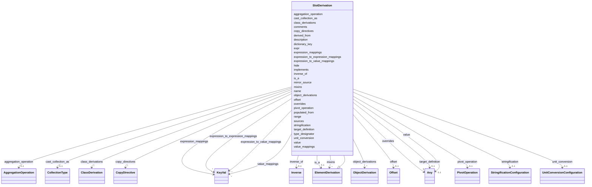

---
search:
  boost: 10.0
---

# Class: SlotDerivation 


_A specification of how to derive the value of a target slot from a source slot_


<div data-search-exclude markdown="1">


URI: [linkmlmap:SlotDerivation](https://w3id.org/linkml/transformer/SlotDerivation)



```mermaid
 classDiagram
    class SlotDerivation
    click SlotDerivation href "../SlotDerivation/"
      ElementDerivation <|-- SlotDerivation
        click ElementDerivation href "../ElementDerivation/"
      
      SlotDerivation : aggregation_operation
        
          
    
        
        
        SlotDerivation --> "0..1" AggregationOperation : aggregation_operation
        click AggregationOperation href "../AggregationOperation/"
    

        
      SlotDerivation : cast_collection_as
        
          
    
        
        
        SlotDerivation --> "0..1" CollectionType : cast_collection_as
        click CollectionType href "../CollectionType/"
    

        
      SlotDerivation : class_derivations
        
          
    
        
        
        SlotDerivation --> "*" ClassDerivation : class_derivations
        click ClassDerivation href "../ClassDerivation/"
    

        
      SlotDerivation : comments
        
      SlotDerivation : copy_directives
        
          
    
        
        
        SlotDerivation --> "*" CopyDirective : copy_directives
        click CopyDirective href "../CopyDirective/"
    

        
      SlotDerivation : derived_from
        
      SlotDerivation : description
        
      SlotDerivation : dictionary_key
        
      SlotDerivation : expr
        
      SlotDerivation : expression_mappings
        
          
    
        
        
        SlotDerivation --> "*" KeyVal : expression_mappings
        click KeyVal href "../KeyVal/"
    

        
      SlotDerivation : expression_to_expression_mappings
        
          
    
        
        
        SlotDerivation --> "*" KeyVal : expression_to_expression_mappings
        click KeyVal href "../KeyVal/"
    

        
      SlotDerivation : expression_to_value_mappings
        
          
    
        
        
        SlotDerivation --> "*" KeyVal : expression_to_value_mappings
        click KeyVal href "../KeyVal/"
    

        
      SlotDerivation : hide
        
      SlotDerivation : implements
        
      SlotDerivation : inverse_of
        
          
    
        
        
        SlotDerivation --> "0..1" Inverse : inverse_of
        click Inverse href "../Inverse/"
    

        
      SlotDerivation : is_a
        
          
    
        
        
        SlotDerivation --> "0..1" ElementDerivation : is_a
        click ElementDerivation href "../ElementDerivation/"
    

        
      SlotDerivation : mirror_source
        
      SlotDerivation : mixins
        
          
    
        
        
        SlotDerivation --> "*" ElementDerivation : mixins
        click ElementDerivation href "../ElementDerivation/"
    

        
      SlotDerivation : name
        
      SlotDerivation : object_derivations
        
          
    
        
        
        SlotDerivation --> "*" ObjectDerivation : object_derivations
        click ObjectDerivation href "../ObjectDerivation/"
    

        
      SlotDerivation : offset
        
          
    
        
        
        SlotDerivation --> "0..1" Offset : offset
        click Offset href "../Offset/"
    

        
      SlotDerivation : overrides
        
          
    
        
        
        SlotDerivation --> "0..1" Any : overrides
        click Any href "../Any/"
    

        
      SlotDerivation : pivot_operation
        
          
    
        
        
        SlotDerivation --> "0..1" PivotOperation : pivot_operation
        click PivotOperation href "../PivotOperation/"
    

        
      SlotDerivation : populated_from
        
      SlotDerivation : range
        
      SlotDerivation : sources
        
      SlotDerivation : stringification
        
          
    
        
        
        SlotDerivation --> "0..1" StringificationConfiguration : stringification
        click StringificationConfiguration href "../StringificationConfiguration/"
    

        
      SlotDerivation : target_definition
        
          
    
        
        
        SlotDerivation --> "0..1" Any : target_definition
        click Any href "../Any/"
    

        
      SlotDerivation : type_designator
        
      SlotDerivation : unit_conversion
        
          
    
        
        
        SlotDerivation --> "0..1" UnitConversionConfiguration : unit_conversion
        click UnitConversionConfiguration href "../UnitConversionConfiguration/"
    

        
      SlotDerivation : value
        
          
    
        
        
        SlotDerivation --> "0..1" Any : value
        click Any href "../Any/"
    

        
      SlotDerivation : value_mappings
        
          
    
        
        
        SlotDerivation --> "*" KeyVal : value_mappings
        click KeyVal href "../KeyVal/"
    

        
      
```


## Inheritance
* [SpecificationComponent](SpecificationComponent.md)
    * [ElementDerivation](ElementDerivation.md)
        * **SlotDerivation**


## Slots

| Name | Cardinality and Range | Description | Inheritance |
| ---  | --- | --- | --- |
| [name](name.md) | 1 <br/> [String](String.md) | Target slot name | direct |
| [populated_from](populated_from.md) | 0..1 <br/> [SlotReference](SlotReference.md) | Source slot to derive this target slot from | direct |
| [sources](sources.md) | * <br/> [SlotReference](SlotReference.md) | Deprecated | direct |
| [class_derivations](class_derivations.md) | * <br/> [ClassDerivation](ClassDerivation.md) | Instructions on how to derive nested class instances for this slot | direct |
| [object_derivations](object_derivations.md) | * <br/> [ObjectDerivation](ObjectDerivation.md) | Deprecated | direct |
| [derived_from](derived_from.md) | * <br/> [SlotReference](SlotReference.md) | Deprecated | direct |
| [expr](expr.md) | 0..1 <br/> [String](String.md) | An expression to be evaluated on the source object to derive the target slot | direct |
| [value](value.md) | 0..1 <br/> [Any](Any.md) | A constant value to assign to the target slot | direct |
| [range](range.md) | 0..1 <br/> [String](String.md) | The range (value type) to assign to the derived target slot, overriding the r... | direct |
| [unit_conversion](unit_conversion.md) | 0..1 <br/> [UnitConversionConfiguration](UnitConversionConfiguration.md) | Configuration for converting the source value's unit of measure when deriving... | direct |
| [inverse_of](inverse_of.md) | 0..1 <br/> [Inverse](Inverse.md) | Used to specify a class-slot tuple that is the inverse of the derived/target ... | direct |
| [hide](hide.md) | 0..1 <br/> [Boolean](Boolean.md) | True if this is suppressed | direct |
| [type_designator](type_designator.md) | 0..1 <br/> [Boolean](Boolean.md) | True if this target slot designates the type (class) of the instance, analogo... | direct |
| [target_definition](target_definition.md) | 0..1 <br/> [Any](Any.md) | LinkML definition object for this slot | direct |
| [cast_collection_as](cast_collection_as.md) | 0..1 <br/> [CollectionType](CollectionType.md) | Coerce the derived slot's collection form (for example single-valued, list, o... | direct |
| [dictionary_key](dictionary_key.md) | 0..1 <br/> [String](String.md) | When the derived value is a list of objects, the slot whose value is used as ... | direct |
| [stringification](stringification.md) | 0..1 <br/> [StringificationConfiguration](StringificationConfiguration.md) | Configuration for combining multiple values into a single string value | direct |
| [aggregation_operation](aggregation_operation.md) | 0..1 <br/> [AggregationOperation](AggregationOperation.md) | An aggregation operation that reduces multiple source values into this slot's... | direct |
| [pivot_operation](pivot_operation.md) | 0..1 <br/> [PivotOperation](PivotOperation.md) | Configuration for pivot (melt) operations producing this slot | direct |
| [offset](offset.md) | 0..1 <br/> [Offset](Offset.md) | Configuration for calculating a value by applying an offset to a baseline val... | direct |
| [copy_directives](copy_directives.md) | * <br/> [CopyDirective](CopyDirective.md) | Directives controlling which sub-elements of the source element are copied in... | [ElementDerivation](ElementDerivation.md) |
| [overrides](overrides.md) | 0..1 <br/> [Any](Any.md) | overrides source schema slots | [ElementDerivation](ElementDerivation.md) |
| [is_a](is_a.md) | 0..1 <br/> [ElementDerivation](ElementDerivation.md) | The parent element that the derived target element inherits from | [ElementDerivation](ElementDerivation.md) |
| [mixins](mixins.md) | * <br/> [ElementDerivation](ElementDerivation.md) | Mixin elements applied to the derived target element | [ElementDerivation](ElementDerivation.md) |
| [value_mappings](value_mappings.md) | * <br/> [KeyVal](KeyVal.md) | A mapping table that is applied directly to mappings, in order of precedence | [ElementDerivation](ElementDerivation.md) |
| [expression_mappings](expression_mappings.md) | * <br/> [KeyVal](KeyVal.md) | A mapping table where the values are expressions evaluated against source bin... | [ElementDerivation](ElementDerivation.md) |
| [expression_to_value_mappings](expression_to_value_mappings.md) | * <br/> [KeyVal](KeyVal.md) | A mapping table in which the keys are boolean expressions and the values are ... | [ElementDerivation](ElementDerivation.md) |
| [expression_to_expression_mappings](expression_to_expression_mappings.md) | * <br/> [KeyVal](KeyVal.md) | A mapping table in which the keys and values are expressions | [ElementDerivation](ElementDerivation.md) |
| [mirror_source](mirror_source.md) | 0..1 <br/> [Boolean](Boolean.md) | If true, pass the source value through unchanged instead of transforming it | [ElementDerivation](ElementDerivation.md) |
| [description](description.md) | 0..1 <br/> [String](String.md) | description of the specification component | [SpecificationComponent](SpecificationComponent.md) |
| [implements](implements.md) | * <br/> [Uriorcurie](Uriorcurie.md) | A reference to a specification that this component implements | [SpecificationComponent](SpecificationComponent.md) |
| [comments](comments.md) | * <br/> [String](String.md) | A list of comments about this component | [SpecificationComponent](SpecificationComponent.md) |


## Usages

| used by | used in | type | used |
| ---  | --- | --- | --- |
| [TransformationSpecification](TransformationSpecification.md) | [slot_derivations](slot_derivations.md) | range | [SlotDerivation](SlotDerivation.md) |
| [ClassDerivation](ClassDerivation.md) | [slot_derivations](slot_derivations.md) | range | [SlotDerivation](SlotDerivation.md) |


## Identifier and Mapping Information


### Schema Source


* from schema: https://w3id.org/linkml/transformer


## Mappings

| Mapping Type | Mapped Value |
| ---  | ---  |
| self | linkmlmap:SlotDerivation |
| native | linkmlmap:SlotDerivation |


## LinkML Source

<!-- TODO: investigate https://stackoverflow.com/questions/37606292/how-to-create-tabbed-code-blocks-in-mkdocs-or-sphinx -->

### Direct

<details>
```yaml
name: SlotDerivation
description: A specification of how to derive the value of a target slot from a source
  slot
from_schema: https://w3id.org/linkml/transformer
is_a: ElementDerivation
attributes:
  name:
    name: name
    description: Target slot name
    from_schema: https://w3id.org/linkml/transformer
    key: true
    domain_of:
    - SchemaReference
    - ElementDerivation
    - ObjectDerivation
    - SlotDerivation
    - EnumDerivation
    - PermissibleValueDerivation
    - Agent
  populated_from:
    name: populated_from
    description: Source slot to derive this target slot from.
    from_schema: https://w3id.org/linkml/transformer
    domain_of:
    - ClassDerivation
    - SlotDerivation
    - EnumDerivation
    - PermissibleValueDerivation
    range: SlotReference
  sources:
    name: sources
    description: Deprecated. Use populated_from instead.
    deprecated: Deprecated. Use populated_from instead. See https://github.com/linkml/linkml-map/issues/193
      for planned list support in populated_from. Will be removed in a future version.
    from_schema: https://w3id.org/linkml/transformer
    domain_of:
    - ClassDerivation
    - SlotDerivation
    - EnumDerivation
    - PermissibleValueDerivation
    range: SlotReference
    multivalued: true
  class_derivations:
    name: class_derivations
    description: Instructions on how to derive nested class instances for this slot.
      Each entry specifies how to construct an instance of a target class from source
      data. For multivalued slots, each entry produces one object in the resulting
      list.
    from_schema: https://w3id.org/linkml/transformer
    domain_of:
    - TransformationSpecification
    - ObjectDerivation
    - SlotDerivation
    range: ClassDerivation
    multivalued: true
    inlined: true
    inlined_as_list: true
  object_derivations:
    name: object_derivations
    description: Deprecated. Use list-based class_derivations instead. One or more
      object derivations used to construct the slot value(s), which must be instances
      of a class.
    deprecated: Use list-based class_derivations instead of nesting via object_derivations.
      See https://github.com/linkml/linkml-map/issues/112
    from_schema: https://w3id.org/linkml/transformer
    rank: 1000
    domain_of:
    - SlotDerivation
    range: ObjectDerivation
    multivalued: true
    inlined: true
    inlined_as_list: true
  derived_from:
    name: derived_from
    description: Deprecated. This field is ignored by the runtime and will be removed.
      It was intended to list source slots feeding into an expr-based derivation,
      but this information is fully derivable from the expr itself.
    deprecated: This field is fully derivable from expr and is not used by the runtime.
      It will be removed in a future version.
    from_schema: https://w3id.org/linkml/transformer
    rank: 1000
    domain_of:
    - SlotDerivation
    range: SlotReference
    multivalued: true
  expr:
    name: expr
    description: An expression to be evaluated on the source object to derive the
      target slot. Should be specified using the LinkML expression language.
    from_schema: https://w3id.org/linkml/transformer
    rank: 1000
    domain_of:
    - SlotDerivation
    - EnumDerivation
    - PermissibleValueDerivation
    range: string
  value:
    name: value
    description: A constant value to assign to the target slot.
    from_schema: https://w3id.org/linkml/transformer
    rank: 1000
    domain_of:
    - SlotDerivation
    - KeyVal
    range: Any
  range:
    name: range
    description: The range (value type) to assign to the derived target slot, overriding
      the range inferred from the source.
    from_schema: https://w3id.org/linkml/transformer
    rank: 1000
    slot_uri: linkml:range
    domain_of:
    - SlotDerivation
    range: string
  unit_conversion:
    name: unit_conversion
    description: Configuration for converting the source value's unit of measure when
      deriving this slot.
    from_schema: https://w3id.org/linkml/transformer
    rank: 1000
    domain_of:
    - SlotDerivation
    range: UnitConversionConfiguration
  inverse_of:
    name: inverse_of
    description: Used to specify a class-slot tuple that is the inverse of the derived/target
      slot. This is used primarily for mapping to relational databases or formalisms
      that do not allow multiple values. The class representing the repeated element
      has a foreign key slot inserted in that 'back references' the original multivalued
      slot.
    from_schema: https://w3id.org/linkml/transformer
    rank: 1000
    domain_of:
    - SlotDerivation
    range: Inverse
  hide:
    name: hide
    description: True if this is suppressed
    from_schema: https://w3id.org/linkml/transformer
    rank: 1000
    domain_of:
    - SlotDerivation
    - EnumDerivation
    - PermissibleValueDerivation
    range: boolean
  type_designator:
    name: type_designator
    description: True if this target slot designates the type (class) of the instance,
      analogous to LinkML's designates_type.
    from_schema: https://w3id.org/linkml/transformer
    rank: 1000
    domain_of:
    - SlotDerivation
    range: boolean
  target_definition:
    name: target_definition
    description: LinkML definition object for this slot.
    comments:
    - currently defined as Any to avoid coupling with metamodel
    from_schema: https://w3id.org/linkml/transformer
    domain_of:
    - ClassDerivation
    - SlotDerivation
    range: Any
  cast_collection_as:
    name: cast_collection_as
    description: Coerce the derived slot's collection form (for example single-valued,
      list, or dictionary).
    from_schema: https://w3id.org/linkml/transformer
    rank: 1000
    domain_of:
    - SlotDerivation
    range: CollectionType
  dictionary_key:
    name: dictionary_key
    description: When the derived value is a list of objects, the slot whose value
      is used as the key to index them into a dictionary.
    from_schema: https://w3id.org/linkml/transformer
    rank: 1000
    domain_of:
    - SlotDerivation
    range: string
  stringification:
    name: stringification
    description: Configuration for combining multiple values into a single string
      value.
    from_schema: https://w3id.org/linkml/transformer
    rank: 1000
    domain_of:
    - SlotDerivation
    range: StringificationConfiguration
  aggregation_operation:
    name: aggregation_operation
    description: An aggregation operation that reduces multiple source values into
      this slot's value.
    from_schema: https://w3id.org/linkml/transformer
    rank: 1000
    domain_of:
    - SlotDerivation
    range: AggregationOperation
  pivot_operation:
    name: pivot_operation
    description: Configuration for pivot (melt) operations producing this slot
    from_schema: https://w3id.org/linkml/transformer
    domain_of:
    - ClassDerivation
    - SlotDerivation
    range: PivotOperation
  offset:
    name: offset
    description: Configuration for calculating a value by applying an offset to a
      baseline value. The baseline value comes from the slot's populated_from field.
      This is commonly used for longitudinal data where measurements are recorded
      relative to a baseline. For example, calculating age_at_visit from age + (days
      * 1/365).
    from_schema: https://w3id.org/linkml/transformer
    rank: 1000
    domain_of:
    - SlotDerivation
    range: Offset

```
</details>

### Induced

<details>
```yaml
name: SlotDerivation
description: A specification of how to derive the value of a target slot from a source
  slot
from_schema: https://w3id.org/linkml/transformer
is_a: ElementDerivation
attributes:
  name:
    name: name
    description: Target slot name
    from_schema: https://w3id.org/linkml/transformer
    key: true
    owner: SlotDerivation
    domain_of:
    - SchemaReference
    - ElementDerivation
    - ObjectDerivation
    - SlotDerivation
    - EnumDerivation
    - PermissibleValueDerivation
    - Agent
    required: true
  populated_from:
    name: populated_from
    description: Source slot to derive this target slot from.
    from_schema: https://w3id.org/linkml/transformer
    owner: SlotDerivation
    domain_of:
    - ClassDerivation
    - SlotDerivation
    - EnumDerivation
    - PermissibleValueDerivation
    range: SlotReference
  sources:
    name: sources
    description: Deprecated. Use populated_from instead.
    deprecated: Deprecated. Use populated_from instead. See https://github.com/linkml/linkml-map/issues/193
      for planned list support in populated_from. Will be removed in a future version.
    from_schema: https://w3id.org/linkml/transformer
    owner: SlotDerivation
    domain_of:
    - ClassDerivation
    - SlotDerivation
    - EnumDerivation
    - PermissibleValueDerivation
    range: SlotReference
    multivalued: true
  class_derivations:
    name: class_derivations
    description: Instructions on how to derive nested class instances for this slot.
      Each entry specifies how to construct an instance of a target class from source
      data. For multivalued slots, each entry produces one object in the resulting
      list.
    from_schema: https://w3id.org/linkml/transformer
    owner: SlotDerivation
    domain_of:
    - TransformationSpecification
    - ObjectDerivation
    - SlotDerivation
    range: ClassDerivation
    multivalued: true
    inlined: true
    inlined_as_list: true
  object_derivations:
    name: object_derivations
    description: Deprecated. Use list-based class_derivations instead. One or more
      object derivations used to construct the slot value(s), which must be instances
      of a class.
    deprecated: Use list-based class_derivations instead of nesting via object_derivations.
      See https://github.com/linkml/linkml-map/issues/112
    from_schema: https://w3id.org/linkml/transformer
    rank: 1000
    owner: SlotDerivation
    domain_of:
    - SlotDerivation
    range: ObjectDerivation
    multivalued: true
    inlined: true
    inlined_as_list: true
  derived_from:
    name: derived_from
    description: Deprecated. This field is ignored by the runtime and will be removed.
      It was intended to list source slots feeding into an expr-based derivation,
      but this information is fully derivable from the expr itself.
    deprecated: This field is fully derivable from expr and is not used by the runtime.
      It will be removed in a future version.
    from_schema: https://w3id.org/linkml/transformer
    rank: 1000
    owner: SlotDerivation
    domain_of:
    - SlotDerivation
    range: SlotReference
    multivalued: true
  expr:
    name: expr
    description: An expression to be evaluated on the source object to derive the
      target slot. Should be specified using the LinkML expression language.
    from_schema: https://w3id.org/linkml/transformer
    rank: 1000
    owner: SlotDerivation
    domain_of:
    - SlotDerivation
    - EnumDerivation
    - PermissibleValueDerivation
    range: string
  value:
    name: value
    description: A constant value to assign to the target slot.
    from_schema: https://w3id.org/linkml/transformer
    rank: 1000
    owner: SlotDerivation
    domain_of:
    - SlotDerivation
    - KeyVal
    range: Any
  range:
    name: range
    description: The range (value type) to assign to the derived target slot, overriding
      the range inferred from the source.
    from_schema: https://w3id.org/linkml/transformer
    rank: 1000
    slot_uri: linkml:range
    owner: SlotDerivation
    domain_of:
    - SlotDerivation
    range: string
  unit_conversion:
    name: unit_conversion
    description: Configuration for converting the source value's unit of measure when
      deriving this slot.
    from_schema: https://w3id.org/linkml/transformer
    rank: 1000
    owner: SlotDerivation
    domain_of:
    - SlotDerivation
    range: UnitConversionConfiguration
  inverse_of:
    name: inverse_of
    description: Used to specify a class-slot tuple that is the inverse of the derived/target
      slot. This is used primarily for mapping to relational databases or formalisms
      that do not allow multiple values. The class representing the repeated element
      has a foreign key slot inserted in that 'back references' the original multivalued
      slot.
    from_schema: https://w3id.org/linkml/transformer
    rank: 1000
    owner: SlotDerivation
    domain_of:
    - SlotDerivation
    range: Inverse
  hide:
    name: hide
    description: True if this is suppressed
    from_schema: https://w3id.org/linkml/transformer
    rank: 1000
    owner: SlotDerivation
    domain_of:
    - SlotDerivation
    - EnumDerivation
    - PermissibleValueDerivation
    range: boolean
  type_designator:
    name: type_designator
    description: True if this target slot designates the type (class) of the instance,
      analogous to LinkML's designates_type.
    from_schema: https://w3id.org/linkml/transformer
    rank: 1000
    owner: SlotDerivation
    domain_of:
    - SlotDerivation
    range: boolean
  target_definition:
    name: target_definition
    description: LinkML definition object for this slot.
    comments:
    - currently defined as Any to avoid coupling with metamodel
    from_schema: https://w3id.org/linkml/transformer
    owner: SlotDerivation
    domain_of:
    - ClassDerivation
    - SlotDerivation
    range: Any
  cast_collection_as:
    name: cast_collection_as
    description: Coerce the derived slot's collection form (for example single-valued,
      list, or dictionary).
    from_schema: https://w3id.org/linkml/transformer
    rank: 1000
    owner: SlotDerivation
    domain_of:
    - SlotDerivation
    range: CollectionType
  dictionary_key:
    name: dictionary_key
    description: When the derived value is a list of objects, the slot whose value
      is used as the key to index them into a dictionary.
    from_schema: https://w3id.org/linkml/transformer
    rank: 1000
    owner: SlotDerivation
    domain_of:
    - SlotDerivation
    range: string
  stringification:
    name: stringification
    description: Configuration for combining multiple values into a single string
      value.
    from_schema: https://w3id.org/linkml/transformer
    rank: 1000
    owner: SlotDerivation
    domain_of:
    - SlotDerivation
    range: StringificationConfiguration
  aggregation_operation:
    name: aggregation_operation
    description: An aggregation operation that reduces multiple source values into
      this slot's value.
    from_schema: https://w3id.org/linkml/transformer
    rank: 1000
    owner: SlotDerivation
    domain_of:
    - SlotDerivation
    range: AggregationOperation
  pivot_operation:
    name: pivot_operation
    description: Configuration for pivot (melt) operations producing this slot
    from_schema: https://w3id.org/linkml/transformer
    owner: SlotDerivation
    domain_of:
    - ClassDerivation
    - SlotDerivation
    range: PivotOperation
  offset:
    name: offset
    description: Configuration for calculating a value by applying an offset to a
      baseline value. The baseline value comes from the slot's populated_from field.
      This is commonly used for longitudinal data where measurements are recorded
      relative to a baseline. For example, calculating age_at_visit from age + (days
      * 1/365).
    from_schema: https://w3id.org/linkml/transformer
    rank: 1000
    owner: SlotDerivation
    domain_of:
    - SlotDerivation
    range: Offset
  copy_directives:
    name: copy_directives
    description: Directives controlling which sub-elements of the source element are
      copied into the derived target element.
    from_schema: https://w3id.org/linkml/transformer
    owner: SlotDerivation
    domain_of:
    - TransformationSpecification
    - ElementDerivation
    range: CopyDirective
    multivalued: true
    inlined: true
  overrides:
    name: overrides
    description: overrides source schema slots
    from_schema: https://w3id.org/linkml/transformer
    rank: 1000
    owner: SlotDerivation
    domain_of:
    - ElementDerivation
    range: Any
  is_a:
    name: is_a
    description: The parent element that the derived target element inherits from.
    from_schema: https://w3id.org/linkml/transformer
    rank: 1000
    slot_uri: linkml:is_a
    owner: SlotDerivation
    domain_of:
    - ElementDerivation
    range: ElementDerivation
  mixins:
    name: mixins
    description: Mixin elements applied to the derived target element.
    from_schema: https://w3id.org/linkml/transformer
    rank: 1000
    slot_uri: linkml:mixins
    owner: SlotDerivation
    domain_of:
    - ElementDerivation
    range: ElementDerivation
    multivalued: true
    inlined: false
  value_mappings:
    name: value_mappings
    description: A mapping table that is applied directly to mappings, in order of
      precedence. Keys should always be quoted in YAML to prevent type coercion —
      unquoted true/false become booleans and bare numbers become integers, which
      will not match the stringified source value used for lookup.
    from_schema: https://w3id.org/linkml/transformer
    rank: 1000
    owner: SlotDerivation
    domain_of:
    - ElementDerivation
    range: KeyVal
    multivalued: true
    inlined: true
  expression_mappings:
    name: expression_mappings
    description: A mapping table where the values are expressions evaluated against
      source bindings. Looked up by the same key as value_mappings (the stringified
      source value). Keys should always be quoted (see value_mappings). If both value_mappings
      and expression_mappings are present, value_mappings takes precedence for keys
      that appear in both.
    from_schema: https://w3id.org/linkml/transformer
    rank: 1000
    owner: SlotDerivation
    domain_of:
    - ElementDerivation
    range: KeyVal
    multivalued: true
    inlined: true
  expression_to_value_mappings:
    name: expression_to_value_mappings
    description: 'A mapping table in which the keys are boolean expressions and the
      values are literal results. On enum derivations, used for scalar binning: each
      key is evaluated with value() bound to the incoming value, and the first truthy
      key''s value is returned as the target permissible value. See issue #99.'
    from_schema: https://w3id.org/linkml/transformer
    rank: 1000
    owner: SlotDerivation
    domain_of:
    - ElementDerivation
    range: KeyVal
    multivalued: true
    inlined: true
  expression_to_expression_mappings:
    name: expression_to_expression_mappings
    description: A mapping table in which the keys and values are expressions
    deprecated: 'Deprecated: use case() with and/or operators instead (#127). Will
      be removed before 1.0.'
    from_schema: https://w3id.org/linkml/transformer
    rank: 1000
    owner: SlotDerivation
    domain_of:
    - ElementDerivation
    range: KeyVal
    multivalued: true
    inlined: true
  mirror_source:
    name: mirror_source
    description: If true, pass the source value through unchanged instead of transforming
      it.
    from_schema: https://w3id.org/linkml/transformer
    rank: 1000
    owner: SlotDerivation
    domain_of:
    - ElementDerivation
    range: boolean
  description:
    name: description
    description: description of the specification component
    from_schema: https://w3id.org/linkml/transformer
    rank: 1000
    slot_uri: dcterms:description
    owner: SlotDerivation
    domain_of:
    - SpecificationComponent
    range: string
  implements:
    name: implements
    description: A reference to a specification that this component implements.
    from_schema: https://w3id.org/linkml/transformer
    rank: 1000
    owner: SlotDerivation
    domain_of:
    - SpecificationComponent
    range: uriorcurie
    multivalued: true
  comments:
    name: comments
    description: A list of comments about this component. Comments are free text,
      and may be used to provide additional information about the component, including
      instructions for its use.
    from_schema: https://w3id.org/linkml/transformer
    rank: 1000
    slot_uri: rdfs:comment
    owner: SlotDerivation
    domain_of:
    - SpecificationComponent
    range: string
    multivalued: true

```
</details></div>