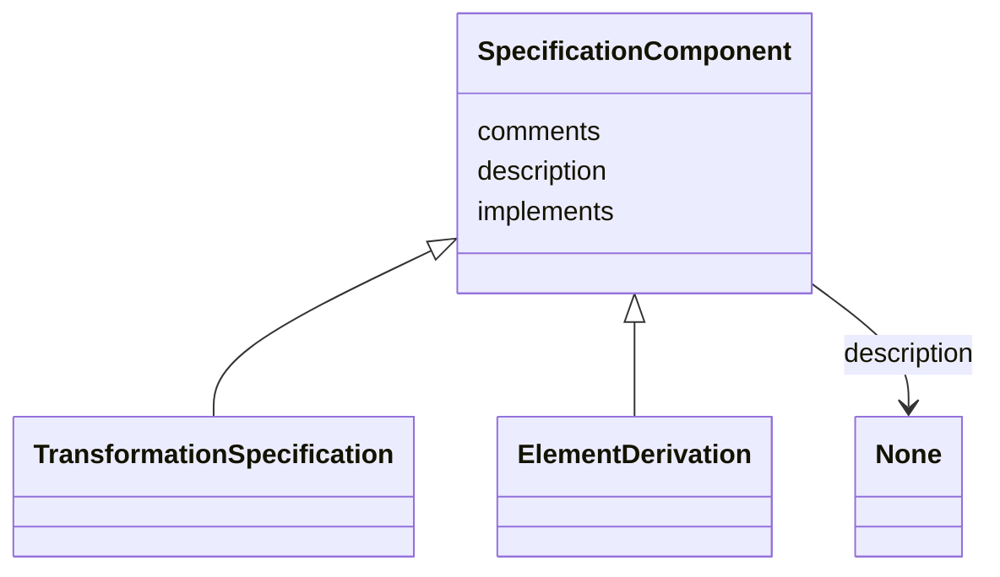

# Class: SpecificationComponent


* __NOTE__: this is an abstract class and should not be instantiated directly


URI: [linkmltr:SpecificationComponent](https://w3id.org/linkml/transformer/SpecificationComponent)





## Inheritance
* **SpecificationComponent**
    * [TransformationSpecification](TransformationSpecification.md)
    * [ElementDerivation](ElementDerivation.md)


## Slots

| Name | Cardinality and Range | Description | Inheritance |
| ---  | --- | --- | --- |
| [description](description.md) | 0..1 <br/> [String](String.md) | description of the specification component | direct |
| [implements](implements.md) | 0..* <br/> [Uriorcurie](Uriorcurie.md) | A reference to a specification that this component implements | direct |
| [comments](comments.md) | 0..* <br/> [String](String.md) | A list of comments about this component | direct |


## Identifier and Mapping Information


### Schema Source


* from schema: https://w3id.org/linkml/transformer


## Mappings

| Mapping Type | Mapped Value |
| ---  | ---  |
| self | linkmltr:SpecificationComponent |
| native | linkmltr:SpecificationComponent |


## LinkML Source

<!-- TODO: investigate https://stackoverflow.com/questions/37606292/how-to-create-tabbed-code-blocks-in-mkdocs-or-sphinx -->

### Direct

<details>
```yaml
name: SpecificationComponent
from_schema: https://w3id.org/linkml/transformer
abstract: true
attributes:
  description:
    name: description
    description: description of the specification component
    from_schema: https://w3id.org/linkml/transformer
    rank: 1000
    slot_uri: dcterms:description
    domain_of:
    - SpecificationComponent
  implements:
    name: implements
    description: A reference to a specification that this component implements.
    from_schema: https://w3id.org/linkml/transformer
    rank: 1000
    multivalued: true
    domain_of:
    - SpecificationComponent
    range: uriorcurie
  comments:
    name: comments
    description: A list of comments about this component. Comments are free text,
      and may be used to provide additional information about the component, including
      instructions for its use.
    from_schema: https://w3id.org/linkml/transformer
    rank: 1000
    slot_uri: rdfs:comment
    multivalued: true
    domain_of:
    - SpecificationComponent
    range: string

```
</details>

### Induced

<details>
```yaml
name: SpecificationComponent
from_schema: https://w3id.org/linkml/transformer
abstract: true
attributes:
  description:
    name: description
    description: description of the specification component
    from_schema: https://w3id.org/linkml/transformer
    rank: 1000
    slot_uri: dcterms:description
    alias: description
    owner: SpecificationComponent
    domain_of:
    - SpecificationComponent
  implements:
    name: implements
    description: A reference to a specification that this component implements.
    from_schema: https://w3id.org/linkml/transformer
    rank: 1000
    multivalued: true
    alias: implements
    owner: SpecificationComponent
    domain_of:
    - SpecificationComponent
    range: uriorcurie
  comments:
    name: comments
    description: A list of comments about this component. Comments are free text,
      and may be used to provide additional information about the component, including
      instructions for its use.
    from_schema: https://w3id.org/linkml/transformer
    rank: 1000
    slot_uri: rdfs:comment
    multivalued: true
    alias: comments
    owner: SpecificationComponent
    domain_of:
    - SpecificationComponent
    range: string

```
</details>