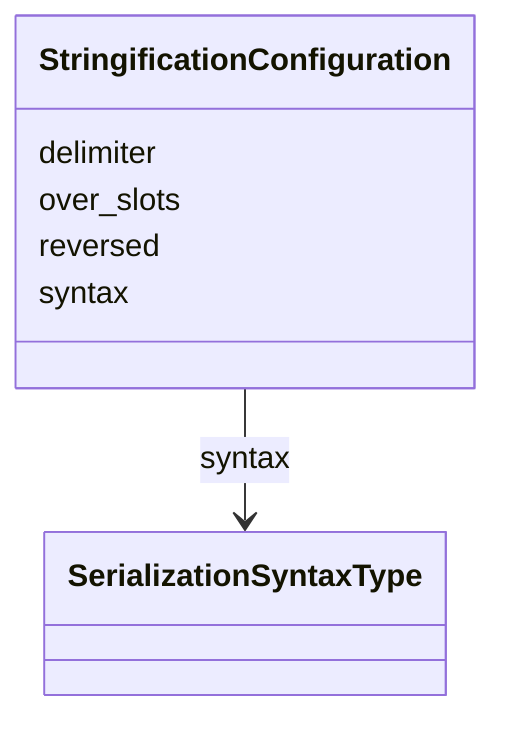

# Class: StringificationConfiguration


URI: [linkmltr:StringificationConfiguration](https://w3id.org/linkml/transformer/StringificationConfiguration)





<!-- no inheritance hierarchy -->


## Slots

| Name | Cardinality and Range | Description | Inheritance |
| ---  | --- | --- | --- |
| [delimiter](delimiter.md) | 0..1 <br/> [String](String.md) |  | direct |
| [reversed](reversed.md) | 0..1 <br/> [Boolean](Boolean.md) |  | direct |
| [over_slots](over_slots.md) | 0..* <br/> [String](String.md) |  | direct |
| [syntax](syntax.md) | 0..1 <br/> [SerializationSyntaxType](SerializationSyntaxType.md) |  | direct |


## Usages

| used by | used in | type | used |
| ---  | --- | --- | --- |
| [SlotDerivation](SlotDerivation.md) | [stringification](stringification.md) | range | [StringificationConfiguration](StringificationConfiguration.md) |


## Identifier and Mapping Information


### Schema Source


* from schema: https://w3id.org/linkml/transformer


## Mappings

| Mapping Type | Mapped Value |
| ---  | ---  |
| self | linkmltr:StringificationConfiguration |
| native | linkmltr:StringificationConfiguration |


## LinkML Source

<!-- TODO: investigate https://stackoverflow.com/questions/37606292/how-to-create-tabbed-code-blocks-in-mkdocs-or-sphinx -->

### Direct

<details>
```yaml
name: StringificationConfiguration
from_schema: https://w3id.org/linkml/transformer
attributes:
  delimiter:
    name: delimiter
    examples:
    - value: ','
    - value: '|'
    - value: ;
    from_schema: https://w3id.org/linkml/transformer
    rank: 1000
    domain_of:
    - StringificationConfiguration
    range: string
  reversed:
    name: reversed
    from_schema: https://w3id.org/linkml/transformer
    rank: 1000
    domain_of:
    - StringificationConfiguration
    range: boolean
  over_slots:
    name: over_slots
    from_schema: https://w3id.org/linkml/transformer
    rank: 1000
    multivalued: true
    domain_of:
    - StringificationConfiguration
    range: string
  syntax:
    name: syntax
    examples:
    - value: json
    - value: yaml
    from_schema: https://w3id.org/linkml/transformer
    rank: 1000
    domain_of:
    - StringificationConfiguration
    range: SerializationSyntaxType

```
</details>

### Induced

<details>
```yaml
name: StringificationConfiguration
from_schema: https://w3id.org/linkml/transformer
attributes:
  delimiter:
    name: delimiter
    examples:
    - value: ','
    - value: '|'
    - value: ;
    from_schema: https://w3id.org/linkml/transformer
    rank: 1000
    alias: delimiter
    owner: StringificationConfiguration
    domain_of:
    - StringificationConfiguration
    range: string
  reversed:
    name: reversed
    from_schema: https://w3id.org/linkml/transformer
    rank: 1000
    alias: reversed
    owner: StringificationConfiguration
    domain_of:
    - StringificationConfiguration
    range: boolean
  over_slots:
    name: over_slots
    from_schema: https://w3id.org/linkml/transformer
    rank: 1000
    multivalued: true
    alias: over_slots
    owner: StringificationConfiguration
    domain_of:
    - StringificationConfiguration
    range: string
  syntax:
    name: syntax
    examples:
    - value: json
    - value: yaml
    from_schema: https://w3id.org/linkml/transformer
    rank: 1000
    alias: syntax
    owner: StringificationConfiguration
    domain_of:
    - StringificationConfiguration
    range: SerializationSyntaxType

```
</details>