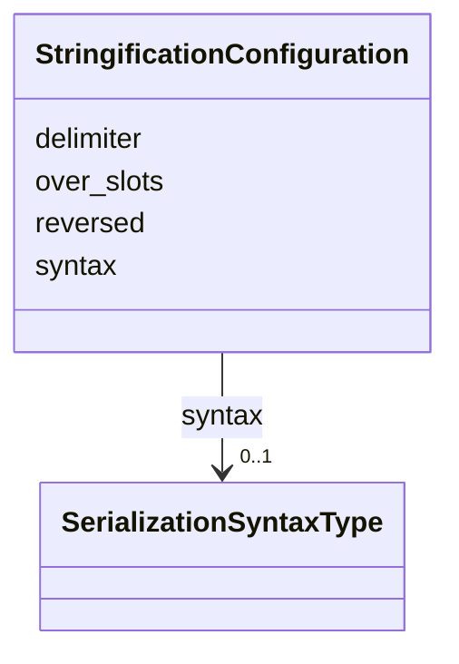

---
search:
  boost: 10.0
---

# Class: StringificationConfiguration 


_Configuration for collapsing multiple values into a single delimited or serialized string value._


<div data-search-exclude markdown="1">


URI: [linkmlmap:StringificationConfiguration](https://w3id.org/linkml/transformer/StringificationConfiguration)



```mermaid
 classDiagram
    class StringificationConfiguration
    click StringificationConfiguration href "../StringificationConfiguration/"
      StringificationConfiguration : delimiter
        
      StringificationConfiguration : over_slots
        
      StringificationConfiguration : reversed
        
      StringificationConfiguration : syntax
        
          
    
        
        
        StringificationConfiguration --> "0..1" SerializationSyntaxType : syntax
        click SerializationSyntaxType href "../SerializationSyntaxType/"
    

        
      
```


<!-- no inheritance hierarchy -->

## Slots

| Name | Cardinality and Range | Description | Inheritance |
| ---  | --- | --- | --- |
| [delimiter](delimiter.md) | 0..1 <br/> [String](String.md) | Delimiter used to join multiple values into a single string | direct |
| [reversed](reversed.md) | 0..1 <br/> [Boolean](Boolean.md) | If true, reverse the operation, splitting a delimited or serialized string ba... | direct |
| [over_slots](over_slots.md) | * <br/> [String](String.md) | The source slots whose values are combined into the stringified result | direct |
| [syntax](syntax.md) | 0..1 <br/> [SerializationSyntaxType](SerializationSyntaxType.md) | Serialization syntax used to stringify the values when no delimiter is given | direct |


## Usages

| used by | used in | type | used |
| ---  | --- | --- | --- |
| [SlotDerivation](SlotDerivation.md) | [stringification](stringification.md) | range | [StringificationConfiguration](StringificationConfiguration.md) |


## Identifier and Mapping Information


### Schema Source


* from schema: https://w3id.org/linkml/transformer


## Mappings

| Mapping Type | Mapped Value |
| ---  | ---  |
| self | linkmlmap:StringificationConfiguration |
| native | linkmlmap:StringificationConfiguration |


## LinkML Source

<!-- TODO: investigate https://stackoverflow.com/questions/37606292/how-to-create-tabbed-code-blocks-in-mkdocs-or-sphinx -->

### Direct

<details>
```yaml
name: StringificationConfiguration
description: Configuration for collapsing multiple values into a single delimited
  or serialized string value.
from_schema: https://w3id.org/linkml/transformer
attributes:
  delimiter:
    name: delimiter
    description: Delimiter used to join multiple values into a single string.
    examples:
    - value: ','
    - value: '|'
    - value: ;
    from_schema: https://w3id.org/linkml/transformer
    rank: 1000
    domain_of:
    - StringificationConfiguration
    range: string
  reversed:
    name: reversed
    description: If true, reverse the operation, splitting a delimited or serialized
      string back into multiple values.
    from_schema: https://w3id.org/linkml/transformer
    rank: 1000
    domain_of:
    - StringificationConfiguration
    range: boolean
  over_slots:
    name: over_slots
    description: The source slots whose values are combined into the stringified result.
    from_schema: https://w3id.org/linkml/transformer
    rank: 1000
    domain_of:
    - StringificationConfiguration
    range: string
    multivalued: true
  syntax:
    name: syntax
    description: Serialization syntax used to stringify the values when no delimiter
      is given.
    examples:
    - value: json
    - value: yaml
    from_schema: https://w3id.org/linkml/transformer
    rank: 1000
    domain_of:
    - StringificationConfiguration
    range: SerializationSyntaxType

```
</details>

### Induced

<details>
```yaml
name: StringificationConfiguration
description: Configuration for collapsing multiple values into a single delimited
  or serialized string value.
from_schema: https://w3id.org/linkml/transformer
attributes:
  delimiter:
    name: delimiter
    description: Delimiter used to join multiple values into a single string.
    examples:
    - value: ','
    - value: '|'
    - value: ;
    from_schema: https://w3id.org/linkml/transformer
    rank: 1000
    owner: StringificationConfiguration
    domain_of:
    - StringificationConfiguration
    range: string
  reversed:
    name: reversed
    description: If true, reverse the operation, splitting a delimited or serialized
      string back into multiple values.
    from_schema: https://w3id.org/linkml/transformer
    rank: 1000
    owner: StringificationConfiguration
    domain_of:
    - StringificationConfiguration
    range: boolean
  over_slots:
    name: over_slots
    description: The source slots whose values are combined into the stringified result.
    from_schema: https://w3id.org/linkml/transformer
    rank: 1000
    owner: StringificationConfiguration
    domain_of:
    - StringificationConfiguration
    range: string
    multivalued: true
  syntax:
    name: syntax
    description: Serialization syntax used to stringify the values when no delimiter
      is given.
    examples:
    - value: json
    - value: yaml
    from_schema: https://w3id.org/linkml/transformer
    rank: 1000
    owner: StringificationConfiguration
    domain_of:
    - StringificationConfiguration
    range: SerializationSyntaxType

```
</details></div>