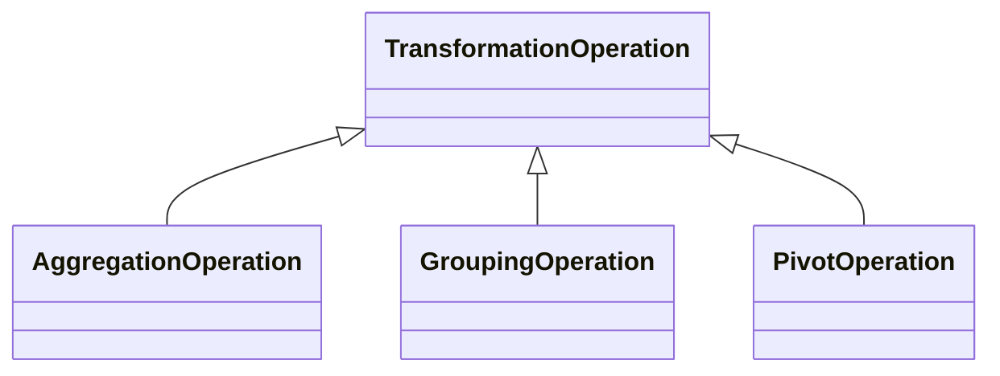

---
search:
  boost: 10.0
---

# Class: TransformationOperation 

<div data-search-exclude markdown="1">


* __NOTE__: this is an abstract class and should not be instantiated directly


URI: [linkmlmap:TransformationOperation](https://w3id.org/linkml/transformer/TransformationOperation)





## Inheritance
* **TransformationOperation**
    * [AggregationOperation](AggregationOperation.md)
    * [GroupingOperation](GroupingOperation.md)
    * [PivotOperation](PivotOperation.md)


## Slots

| Name | Cardinality and Range | Description | Inheritance |
| ---  | --- | --- | --- |


## Identifier and Mapping Information


### Schema Source


* from schema: https://w3id.org/linkml/transformer


## Mappings

| Mapping Type | Mapped Value |
| ---  | ---  |
| self | linkmlmap:TransformationOperation |
| native | linkmlmap:TransformationOperation |


## LinkML Source

<!-- TODO: investigate https://stackoverflow.com/questions/37606292/how-to-create-tabbed-code-blocks-in-mkdocs-or-sphinx -->

### Direct

<details>
```yaml
name: TransformationOperation
from_schema: https://w3id.org/linkml/transformer
abstract: true

```
</details>

### Induced

<details>
```yaml
name: TransformationOperation
from_schema: https://w3id.org/linkml/transformer
abstract: true

```
</details></div>