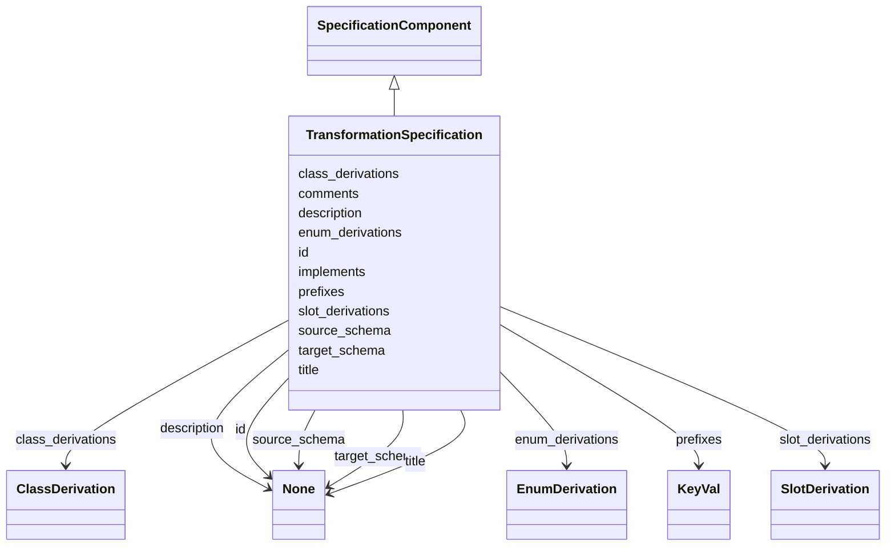

# Class: TransformationSpecification


_A collection of mappings between source and target classes_


URI: [linkmltr:TransformationSpecification](https://w3id.org/linkml/transformer/TransformationSpecification)





## Inheritance
* [SpecificationComponent](SpecificationComponent.md)
    * **TransformationSpecification**


## Slots

| Name | Cardinality and Range | Description | Inheritance |
| ---  | --- | --- | --- |
| [id](id.md) | 0..1 <br/> [String](String.md) | Unique identifier for this transformation specification | direct |
| [title](title.md) | 0..1 <br/> [String](String.md) | human readable title for this transformation specification | direct |
| [prefixes](prefixes.md) | 0..* <br/> [KeyVal](KeyVal.md) | maps prefixes to URL expansions | direct |
| [source_schema](source_schema.md) | 0..1 <br/> [String](String.md) | name of the schema that describes the source (input) objects | direct |
| [target_schema](target_schema.md) | 0..1 <br/> [String](String.md) | name of the schema that describes the target (output) objects | direct |
| [class_derivations](class_derivations.md) | 0..* <br/> [ClassDerivation](ClassDerivation.md) | Instructions on how to derive a set of classes in the target schema from clas... | direct |
| [enum_derivations](enum_derivations.md) | 0..* <br/> [EnumDerivation](EnumDerivation.md) | Instructions on how to derive a set of enums in the target schema | direct |
| [slot_derivations](slot_derivations.md) | 0..* <br/> [SlotDerivation](SlotDerivation.md) | Instructions on how to derive a set of top level slots in the target schema | direct |
| [description](description.md) | 0..1 <br/> [String](String.md) | description of the specification component | [SpecificationComponent](SpecificationComponent.md) |
| [implements](implements.md) | 0..* <br/> [Uriorcurie](Uriorcurie.md) | A reference to a specification that this component implements | [SpecificationComponent](SpecificationComponent.md) |
| [comments](comments.md) | 0..* <br/> [String](String.md) | A list of comments about this component | [SpecificationComponent](SpecificationComponent.md) |


## Identifier and Mapping Information


### Schema Source


* from schema: https://w3id.org/linkml/transformer


## Mappings

| Mapping Type | Mapped Value |
| ---  | ---  |
| self | linkmltr:TransformationSpecification |
| native | linkmltr:TransformationSpecification |


## LinkML Source

<!-- TODO: investigate https://stackoverflow.com/questions/37606292/how-to-create-tabbed-code-blocks-in-mkdocs-or-sphinx -->

### Direct

<details>
```yaml
name: TransformationSpecification
description: A collection of mappings between source and target classes
from_schema: https://w3id.org/linkml/transformer
is_a: SpecificationComponent
attributes:
  id:
    name: id
    description: Unique identifier for this transformation specification
    from_schema: https://w3id.org/linkml/transformer
    rank: 1000
    slot_uri: schema:identifier
    domain_of:
    - TransformationSpecification
  title:
    name: title
    description: human readable title for this transformation specification
    from_schema: https://w3id.org/linkml/transformer
    rank: 1000
    slot_uri: dcterms:title
    domain_of:
    - TransformationSpecification
  prefixes:
    name: prefixes
    description: maps prefixes to URL expansions
    from_schema: https://w3id.org/linkml/transformer
    rank: 1000
    slot_uri: sh:declare
    multivalued: true
    domain_of:
    - TransformationSpecification
    range: KeyVal
    inlined: true
  source_schema:
    name: source_schema
    description: name of the schema that describes the source (input) objects
    from_schema: https://w3id.org/linkml/transformer
    rank: 1000
    domain_of:
    - TransformationSpecification
  target_schema:
    name: target_schema
    description: name of the schema that describes the target (output) objects
    from_schema: https://w3id.org/linkml/transformer
    rank: 1000
    domain_of:
    - TransformationSpecification
  class_derivations:
    name: class_derivations
    description: Instructions on how to derive a set of classes in the target schema
      from classes in the source schema.
    from_schema: https://w3id.org/linkml/transformer
    rank: 1000
    multivalued: true
    domain_of:
    - TransformationSpecification
    range: ClassDerivation
    inlined: true
  enum_derivations:
    name: enum_derivations
    description: Instructions on how to derive a set of enums in the target schema
    from_schema: https://w3id.org/linkml/transformer
    rank: 1000
    multivalued: true
    domain_of:
    - TransformationSpecification
    range: EnumDerivation
    inlined: true
  slot_derivations:
    name: slot_derivations
    description: Instructions on how to derive a set of top level slots in the target
      schema
    from_schema: https://w3id.org/linkml/transformer
    rank: 1000
    multivalued: true
    domain_of:
    - TransformationSpecification
    - ClassDerivation
    range: SlotDerivation
    inlined: true
tree_root: true

```
</details>

### Induced

<details>
```yaml
name: TransformationSpecification
description: A collection of mappings between source and target classes
from_schema: https://w3id.org/linkml/transformer
is_a: SpecificationComponent
attributes:
  id:
    name: id
    description: Unique identifier for this transformation specification
    from_schema: https://w3id.org/linkml/transformer
    rank: 1000
    slot_uri: schema:identifier
    alias: id
    owner: TransformationSpecification
    domain_of:
    - TransformationSpecification
  title:
    name: title
    description: human readable title for this transformation specification
    from_schema: https://w3id.org/linkml/transformer
    rank: 1000
    slot_uri: dcterms:title
    alias: title
    owner: TransformationSpecification
    domain_of:
    - TransformationSpecification
  prefixes:
    name: prefixes
    description: maps prefixes to URL expansions
    from_schema: https://w3id.org/linkml/transformer
    rank: 1000
    slot_uri: sh:declare
    multivalued: true
    alias: prefixes
    owner: TransformationSpecification
    domain_of:
    - TransformationSpecification
    range: KeyVal
    inlined: true
  source_schema:
    name: source_schema
    description: name of the schema that describes the source (input) objects
    from_schema: https://w3id.org/linkml/transformer
    rank: 1000
    alias: source_schema
    owner: TransformationSpecification
    domain_of:
    - TransformationSpecification
  target_schema:
    name: target_schema
    description: name of the schema that describes the target (output) objects
    from_schema: https://w3id.org/linkml/transformer
    rank: 1000
    alias: target_schema
    owner: TransformationSpecification
    domain_of:
    - TransformationSpecification
  class_derivations:
    name: class_derivations
    description: Instructions on how to derive a set of classes in the target schema
      from classes in the source schema.
    from_schema: https://w3id.org/linkml/transformer
    rank: 1000
    multivalued: true
    alias: class_derivations
    owner: TransformationSpecification
    domain_of:
    - TransformationSpecification
    range: ClassDerivation
    inlined: true
  enum_derivations:
    name: enum_derivations
    description: Instructions on how to derive a set of enums in the target schema
    from_schema: https://w3id.org/linkml/transformer
    rank: 1000
    multivalued: true
    alias: enum_derivations
    owner: TransformationSpecification
    domain_of:
    - TransformationSpecification
    range: EnumDerivation
    inlined: true
  slot_derivations:
    name: slot_derivations
    description: Instructions on how to derive a set of top level slots in the target
      schema
    from_schema: https://w3id.org/linkml/transformer
    rank: 1000
    multivalued: true
    alias: slot_derivations
    owner: TransformationSpecification
    domain_of:
    - TransformationSpecification
    - ClassDerivation
    range: SlotDerivation
    inlined: true
  description:
    name: description
    description: description of the specification component
    from_schema: https://w3id.org/linkml/transformer
    rank: 1000
    slot_uri: dcterms:description
    alias: description
    owner: TransformationSpecification
    domain_of:
    - SpecificationComponent
    range: string
  implements:
    name: implements
    description: A reference to a specification that this component implements.
    from_schema: https://w3id.org/linkml/transformer
    rank: 1000
    multivalued: true
    alias: implements
    owner: TransformationSpecification
    domain_of:
    - SpecificationComponent
    range: uriorcurie
  comments:
    name: comments
    description: A list of comments about this component. Comments are free text,
      and may be used to provide additional information about the component, including
      instructions for its use.
    from_schema: https://w3id.org/linkml/transformer
    rank: 1000
    slot_uri: rdfs:comment
    multivalued: true
    alias: comments
    owner: TransformationSpecification
    domain_of:
    - SpecificationComponent
    range: string
tree_root: true

```
</details>