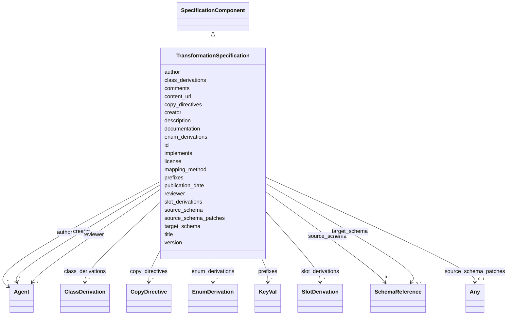

---
search:
  boost: 10.0
---

# Class: TransformationSpecification 


_A collection of mappings between source and target classes_


<div data-search-exclude markdown="1">


URI: [linkmlmap:TransformationSpecification](https://w3id.org/linkml/transformer/TransformationSpecification)



```mermaid
 classDiagram
    class TransformationSpecification
    click TransformationSpecification href "../TransformationSpecification/"
      SpecificationComponent <|-- TransformationSpecification
        click SpecificationComponent href "../SpecificationComponent/"
      
      TransformationSpecification : author
        
          
    
        
        
        TransformationSpecification --> "*" Agent : author
        click Agent href "../Agent/"
    

        
      TransformationSpecification : class_derivations
        
          
    
        
        
        TransformationSpecification --> "*" ClassDerivation : class_derivations
        click ClassDerivation href "../ClassDerivation/"
    

        
      TransformationSpecification : comments
        
      TransformationSpecification : content_url
        
      TransformationSpecification : copy_directives
        
          
    
        
        
        TransformationSpecification --> "*" CopyDirective : copy_directives
        click CopyDirective href "../CopyDirective/"
    

        
      TransformationSpecification : creator
        
          
    
        
        
        TransformationSpecification --> "*" Agent : creator
        click Agent href "../Agent/"
    

        
      TransformationSpecification : description
        
      TransformationSpecification : documentation
        
      TransformationSpecification : enum_derivations
        
          
    
        
        
        TransformationSpecification --> "*" EnumDerivation : enum_derivations
        click EnumDerivation href "../EnumDerivation/"
    

        
      TransformationSpecification : id
        
      TransformationSpecification : implements
        
      TransformationSpecification : license
        
      TransformationSpecification : mapping_method
        
      TransformationSpecification : prefixes
        
          
    
        
        
        TransformationSpecification --> "*" KeyVal : prefixes
        click KeyVal href "../KeyVal/"
    

        
      TransformationSpecification : publication_date
        
      TransformationSpecification : reviewer
        
          
    
        
        
        TransformationSpecification --> "*" Agent : reviewer
        click Agent href "../Agent/"
    

        
      TransformationSpecification : slot_derivations
        
          
    
        
        
        TransformationSpecification --> "*" SlotDerivation : slot_derivations
        click SlotDerivation href "../SlotDerivation/"
    

        
      TransformationSpecification : source_schema
        
          
    
        
        
        TransformationSpecification --> "0..1" SchemaReference : source_schema
        click SchemaReference href "../SchemaReference/"
    

        
      TransformationSpecification : source_schema_patches
        
          
    
        
        
        TransformationSpecification --> "0..1" Any : source_schema_patches
        click Any href "../Any/"
    

        
      TransformationSpecification : target_schema
        
          
    
        
        
        TransformationSpecification --> "0..1" SchemaReference : target_schema
        click SchemaReference href "../SchemaReference/"
    

        
      TransformationSpecification : title
        
      TransformationSpecification : version
        
      
```


## Inheritance
* [SpecificationComponent](SpecificationComponent.md)
    * **TransformationSpecification**


## Class Properties

| Property | Value |
| --- | --- |
| Tree Root | Yes |


## Slots

| Name | Cardinality and Range | Description | Inheritance |
| ---  | --- | --- | --- |
| [id](id.md) | 0..1 <br/> [String](String.md) | Unique identifier for this transformation specification | direct |
| [title](title.md) | 0..1 <br/> [String](String.md) | human readable title for this transformation specification | direct |
| [publication_date](publication_date.md) | 0..1 <br/> [Date](Date.md) | date of publication of this transformation specification | direct |
| [license](license.md) | 0..1 <br/> [Uriorcurie](Uriorcurie.md) | license under which this transformation specification is published | direct |
| [version](version.md) | 0..1 <br/> [String](String.md) | version of this transformation specification | direct |
| [prefixes](prefixes.md) | * <br/> [KeyVal](KeyVal.md) | maps prefixes to URL expansions | direct |
| [copy_directives](copy_directives.md) | * <br/> [CopyDirective](CopyDirective.md) | Directives controlling which elements of the source schema are copied into th... | direct |
| [source_schema](source_schema.md) | 0..1 <br/> [SchemaReference](SchemaReference.md) | Reference to the schema that describes the source (input) objects | direct |
| [target_schema](target_schema.md) | 0..1 <br/> [SchemaReference](SchemaReference.md) | Reference to the schema that describes the target (output) objects | direct |
| [source_schema_patches](source_schema_patches.md) | 0..1 <br/> [Any](Any.md) | Schema patches to apply to the source schema before transformation | direct |
| [creator](creator.md) | * <br/> [Agent](Agent.md) | A list of creators of this transformation specification | direct |
| [author](author.md) | * <br/> [Agent](Agent.md) | A list of authors of this transformation specification | direct |
| [reviewer](reviewer.md) | * <br/> [Agent](Agent.md) | A list of reviewers of this transformation specification | direct |
| [mapping_method](mapping_method.md) | 0..1 <br/> [Uriorcurie](Uriorcurie.md) | The method used to create this mapping, e | direct |
| [documentation](documentation.md) | 0..1 <br/> [Uri](Uri.md) | URL or reference to documentation for the mapping specification | direct |
| [content_url](content_url.md) | 0..1 <br/> [Uri](Uri.md) | Reference to the actual content of the mapping specification | direct |
| [class_derivations](class_derivations.md) | * <br/> [ClassDerivation](ClassDerivation.md) | Instructions on how to derive a set of classes in the target schema from clas... | direct |
| [enum_derivations](enum_derivations.md) | * <br/> [EnumDerivation](EnumDerivation.md) | Instructions on how to derive a set of enums in the target schema | direct |
| [slot_derivations](slot_derivations.md) | * <br/> [SlotDerivation](SlotDerivation.md) | Instructions on how to derive a set of top level slots in the target schema | direct |
| [description](description.md) | 0..1 <br/> [String](String.md) | description of the specification component | [SpecificationComponent](SpecificationComponent.md) |
| [implements](implements.md) | * <br/> [Uriorcurie](Uriorcurie.md) | A reference to a specification that this component implements | [SpecificationComponent](SpecificationComponent.md) |
| [comments](comments.md) | * <br/> [String](String.md) | A list of comments about this component | [SpecificationComponent](SpecificationComponent.md) |


## Identifier and Mapping Information


### Schema Source


* from schema: https://w3id.org/linkml/transformer


## Mappings

| Mapping Type | Mapped Value |
| ---  | ---  |
| self | linkmlmap:TransformationSpecification |
| native | linkmlmap:TransformationSpecification |


## LinkML Source

<!-- TODO: investigate https://stackoverflow.com/questions/37606292/how-to-create-tabbed-code-blocks-in-mkdocs-or-sphinx -->

### Direct

<details>
```yaml
name: TransformationSpecification
description: A collection of mappings between source and target classes
from_schema: https://w3id.org/linkml/transformer
is_a: SpecificationComponent
attributes:
  id:
    name: id
    description: Unique identifier for this transformation specification
    from_schema: https://w3id.org/linkml/transformer
    rank: 1000
    slot_uri: schema:identifier
    domain_of:
    - TransformationSpecification
    - Agent
  title:
    name: title
    description: human readable title for this transformation specification
    from_schema: https://w3id.org/linkml/transformer
    rank: 1000
    slot_uri: dcterms:title
    domain_of:
    - TransformationSpecification
  publication_date:
    name: publication_date
    description: date of publication of this transformation specification
    from_schema: https://w3id.org/linkml/transformer
    rank: 1000
    slot_uri: dcterms:issued
    domain_of:
    - TransformationSpecification
    range: date
  license:
    name: license
    description: license under which this transformation specification is published
    from_schema: https://w3id.org/linkml/transformer
    rank: 1000
    slot_uri: dcterms:license
    domain_of:
    - TransformationSpecification
    range: uriorcurie
  version:
    name: version
    description: version of this transformation specification
    from_schema: https://w3id.org/linkml/transformer
    rank: 1000
    slot_uri: schema:version
    domain_of:
    - TransformationSpecification
    - SchemaReference
    - Software
    range: string
  prefixes:
    name: prefixes
    description: maps prefixes to URL expansions
    from_schema: https://w3id.org/linkml/transformer
    rank: 1000
    slot_uri: sh:declare
    domain_of:
    - TransformationSpecification
    range: KeyVal
    multivalued: true
    inlined: true
  copy_directives:
    name: copy_directives
    description: Directives controlling which elements of the source schema are copied
      into the target schema.
    from_schema: https://w3id.org/linkml/transformer
    rank: 1000
    domain_of:
    - TransformationSpecification
    - ElementDerivation
    range: CopyDirective
    multivalued: true
    inlined: true
  source_schema:
    name: source_schema
    description: Reference to the schema that describes the source (input) objects.
    from_schema: https://w3id.org/linkml/transformer
    rank: 1000
    domain_of:
    - TransformationSpecification
    range: SchemaReference
    inlined: true
  target_schema:
    name: target_schema
    description: Reference to the schema that describes the target (output) objects.
    from_schema: https://w3id.org/linkml/transformer
    rank: 1000
    domain_of:
    - TransformationSpecification
    range: SchemaReference
    inlined: true
  source_schema_patches:
    name: source_schema_patches
    description: Schema patches to apply to the source schema before transformation.
      Useful for adding foreign key relationships to auto-generated schemas. Uses
      LinkML schema YAML structure (classes, slots, attributes, etc.).
    from_schema: https://w3id.org/linkml/transformer
    rank: 1000
    domain_of:
    - TransformationSpecification
    range: Any
  creator:
    name: creator
    description: A list of creators of this transformation specification
    from_schema: https://w3id.org/linkml/transformer
    rank: 1000
    slot_uri: dcterms:creator
    domain_of:
    - TransformationSpecification
    range: Agent
    multivalued: true
    inlined: true
    inlined_as_list: true
  author:
    name: author
    description: A list of authors of this transformation specification
    from_schema: https://w3id.org/linkml/transformer
    rank: 1000
    domain_of:
    - TransformationSpecification
    range: Agent
    multivalued: true
    inlined: true
    inlined_as_list: true
  reviewer:
    name: reviewer
    description: A list of reviewers of this transformation specification
    from_schema: https://w3id.org/linkml/transformer
    rank: 1000
    domain_of:
    - TransformationSpecification
    range: Agent
    multivalued: true
    inlined: true
    inlined_as_list: true
  mapping_method:
    name: mapping_method
    description: The method used to create this mapping, e.g. manual curation, automated
      mapping, etc.
    from_schema: https://w3id.org/linkml/transformer
    rank: 1000
    domain_of:
    - TransformationSpecification
    range: uriorcurie
  documentation:
    name: documentation
    description: URL or reference to documentation for the mapping specification
    from_schema: https://w3id.org/linkml/transformer
    rank: 1000
    domain_of:
    - TransformationSpecification
    range: uri
  content_url:
    name: content_url
    description: Reference to the actual content of the mapping specification
    from_schema: https://w3id.org/linkml/transformer
    rank: 1000
    domain_of:
    - TransformationSpecification
    range: uri
  class_derivations:
    name: class_derivations
    description: Instructions on how to derive a set of classes in the target schema
      from classes in the source schema.
    from_schema: https://w3id.org/linkml/transformer
    rank: 1000
    domain_of:
    - TransformationSpecification
    - ObjectDerivation
    - SlotDerivation
    range: ClassDerivation
    multivalued: true
    inlined: true
    inlined_as_list: true
  enum_derivations:
    name: enum_derivations
    description: Instructions on how to derive a set of enums in the target schema
    from_schema: https://w3id.org/linkml/transformer
    rank: 1000
    domain_of:
    - TransformationSpecification
    range: EnumDerivation
    multivalued: true
    inlined: true
  slot_derivations:
    name: slot_derivations
    description: Instructions on how to derive a set of top level slots in the target
      schema
    deprecated: Not implemented. Top-level slot derivations lack deterministic semantics
      because a slot's derivation depends on the class context in which it appears
      — the same slot may need different derivations in different classes. Use slot_derivations
      within each ClassDerivation instead. See https://github.com/linkml/linkml-map/issues/47
    from_schema: https://w3id.org/linkml/transformer
    rank: 1000
    domain_of:
    - TransformationSpecification
    - ClassDerivation
    range: SlotDerivation
    multivalued: true
    inlined: true
tree_root: true

```
</details>

### Induced

<details>
```yaml
name: TransformationSpecification
description: A collection of mappings between source and target classes
from_schema: https://w3id.org/linkml/transformer
is_a: SpecificationComponent
attributes:
  id:
    name: id
    description: Unique identifier for this transformation specification
    from_schema: https://w3id.org/linkml/transformer
    rank: 1000
    slot_uri: schema:identifier
    owner: TransformationSpecification
    domain_of:
    - TransformationSpecification
    - Agent
  title:
    name: title
    description: human readable title for this transformation specification
    from_schema: https://w3id.org/linkml/transformer
    rank: 1000
    slot_uri: dcterms:title
    owner: TransformationSpecification
    domain_of:
    - TransformationSpecification
  publication_date:
    name: publication_date
    description: date of publication of this transformation specification
    from_schema: https://w3id.org/linkml/transformer
    rank: 1000
    slot_uri: dcterms:issued
    owner: TransformationSpecification
    domain_of:
    - TransformationSpecification
    range: date
  license:
    name: license
    description: license under which this transformation specification is published
    from_schema: https://w3id.org/linkml/transformer
    rank: 1000
    slot_uri: dcterms:license
    owner: TransformationSpecification
    domain_of:
    - TransformationSpecification
    range: uriorcurie
  version:
    name: version
    description: version of this transformation specification
    from_schema: https://w3id.org/linkml/transformer
    rank: 1000
    slot_uri: schema:version
    owner: TransformationSpecification
    domain_of:
    - TransformationSpecification
    - SchemaReference
    - Software
    range: string
  prefixes:
    name: prefixes
    description: maps prefixes to URL expansions
    from_schema: https://w3id.org/linkml/transformer
    rank: 1000
    slot_uri: sh:declare
    owner: TransformationSpecification
    domain_of:
    - TransformationSpecification
    range: KeyVal
    multivalued: true
    inlined: true
  copy_directives:
    name: copy_directives
    description: Directives controlling which elements of the source schema are copied
      into the target schema.
    from_schema: https://w3id.org/linkml/transformer
    rank: 1000
    owner: TransformationSpecification
    domain_of:
    - TransformationSpecification
    - ElementDerivation
    range: CopyDirective
    multivalued: true
    inlined: true
  source_schema:
    name: source_schema
    description: Reference to the schema that describes the source (input) objects.
    from_schema: https://w3id.org/linkml/transformer
    rank: 1000
    owner: TransformationSpecification
    domain_of:
    - TransformationSpecification
    range: SchemaReference
    inlined: true
  target_schema:
    name: target_schema
    description: Reference to the schema that describes the target (output) objects.
    from_schema: https://w3id.org/linkml/transformer
    rank: 1000
    owner: TransformationSpecification
    domain_of:
    - TransformationSpecification
    range: SchemaReference
    inlined: true
  source_schema_patches:
    name: source_schema_patches
    description: Schema patches to apply to the source schema before transformation.
      Useful for adding foreign key relationships to auto-generated schemas. Uses
      LinkML schema YAML structure (classes, slots, attributes, etc.).
    from_schema: https://w3id.org/linkml/transformer
    rank: 1000
    owner: TransformationSpecification
    domain_of:
    - TransformationSpecification
    range: Any
  creator:
    name: creator
    description: A list of creators of this transformation specification
    from_schema: https://w3id.org/linkml/transformer
    rank: 1000
    slot_uri: dcterms:creator
    owner: TransformationSpecification
    domain_of:
    - TransformationSpecification
    range: Agent
    multivalued: true
    inlined: true
    inlined_as_list: true
  author:
    name: author
    description: A list of authors of this transformation specification
    from_schema: https://w3id.org/linkml/transformer
    rank: 1000
    owner: TransformationSpecification
    domain_of:
    - TransformationSpecification
    range: Agent
    multivalued: true
    inlined: true
    inlined_as_list: true
  reviewer:
    name: reviewer
    description: A list of reviewers of this transformation specification
    from_schema: https://w3id.org/linkml/transformer
    rank: 1000
    owner: TransformationSpecification
    domain_of:
    - TransformationSpecification
    range: Agent
    multivalued: true
    inlined: true
    inlined_as_list: true
  mapping_method:
    name: mapping_method
    description: The method used to create this mapping, e.g. manual curation, automated
      mapping, etc.
    from_schema: https://w3id.org/linkml/transformer
    rank: 1000
    owner: TransformationSpecification
    domain_of:
    - TransformationSpecification
    range: uriorcurie
  documentation:
    name: documentation
    description: URL or reference to documentation for the mapping specification
    from_schema: https://w3id.org/linkml/transformer
    rank: 1000
    owner: TransformationSpecification
    domain_of:
    - TransformationSpecification
    range: uri
  content_url:
    name: content_url
    description: Reference to the actual content of the mapping specification
    from_schema: https://w3id.org/linkml/transformer
    rank: 1000
    owner: TransformationSpecification
    domain_of:
    - TransformationSpecification
    range: uri
  class_derivations:
    name: class_derivations
    description: Instructions on how to derive a set of classes in the target schema
      from classes in the source schema.
    from_schema: https://w3id.org/linkml/transformer
    rank: 1000
    owner: TransformationSpecification
    domain_of:
    - TransformationSpecification
    - ObjectDerivation
    - SlotDerivation
    range: ClassDerivation
    multivalued: true
    inlined: true
    inlined_as_list: true
  enum_derivations:
    name: enum_derivations
    description: Instructions on how to derive a set of enums in the target schema
    from_schema: https://w3id.org/linkml/transformer
    rank: 1000
    owner: TransformationSpecification
    domain_of:
    - TransformationSpecification
    range: EnumDerivation
    multivalued: true
    inlined: true
  slot_derivations:
    name: slot_derivations
    description: Instructions on how to derive a set of top level slots in the target
      schema
    deprecated: Not implemented. Top-level slot derivations lack deterministic semantics
      because a slot's derivation depends on the class context in which it appears
      — the same slot may need different derivations in different classes. Use slot_derivations
      within each ClassDerivation instead. See https://github.com/linkml/linkml-map/issues/47
    from_schema: https://w3id.org/linkml/transformer
    rank: 1000
    owner: TransformationSpecification
    domain_of:
    - TransformationSpecification
    - ClassDerivation
    range: SlotDerivation
    multivalued: true
    inlined: true
  description:
    name: description
    description: description of the specification component
    from_schema: https://w3id.org/linkml/transformer
    rank: 1000
    slot_uri: dcterms:description
    owner: TransformationSpecification
    domain_of:
    - SpecificationComponent
    range: string
  implements:
    name: implements
    description: A reference to a specification that this component implements.
    from_schema: https://w3id.org/linkml/transformer
    rank: 1000
    owner: TransformationSpecification
    domain_of:
    - SpecificationComponent
    range: uriorcurie
    multivalued: true
  comments:
    name: comments
    description: A list of comments about this component. Comments are free text,
      and may be used to provide additional information about the component, including
      instructions for its use.
    from_schema: https://w3id.org/linkml/transformer
    rank: 1000
    slot_uri: rdfs:comment
    owner: TransformationSpecification
    domain_of:
    - SpecificationComponent
    range: string
    multivalued: true
tree_root: true

```
</details></div>