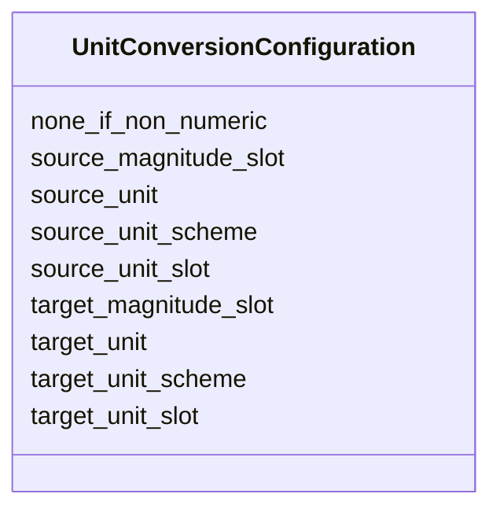

---
search:
  boost: 10.0
---

# Class: UnitConversionConfiguration 


_Configuration for converting a slot value from a source unit of measure to a target unit during transformation._


<div data-search-exclude markdown="1">


URI: [linkmlmap:UnitConversionConfiguration](https://w3id.org/linkml/transformer/UnitConversionConfiguration)



```mermaid
 classDiagram
    class UnitConversionConfiguration
    click UnitConversionConfiguration href "../UnitConversionConfiguration/"
      UnitConversionConfiguration : none_if_non_numeric
        
      UnitConversionConfiguration : source_magnitude_slot
        
      UnitConversionConfiguration : source_unit
        
      UnitConversionConfiguration : source_unit_scheme
        
      UnitConversionConfiguration : source_unit_slot
        
      UnitConversionConfiguration : target_magnitude_slot
        
      UnitConversionConfiguration : target_unit
        
      UnitConversionConfiguration : target_unit_scheme
        
      UnitConversionConfiguration : target_unit_slot
        
      
```


<!-- no inheritance hierarchy -->

## Slots

| Name | Cardinality and Range | Description | Inheritance |
| ---  | --- | --- | --- |
| [target_unit](target_unit.md) | 0..1 <br/> [String](String.md) | The unit to convert the value into | direct |
| [target_unit_scheme](target_unit_scheme.md) | 0..1 <br/> [String](String.md) | The unit scheme or system identifying target_unit (for example ucum) | direct |
| [source_unit](source_unit.md) | 0..1 <br/> [String](String.md) | The unit the source value is expressed in | direct |
| [source_unit_scheme](source_unit_scheme.md) | 0..1 <br/> [String](String.md) | The unit scheme or system identifying source_unit (for example ucum) | direct |
| [source_unit_slot](source_unit_slot.md) | 0..1 <br/> [String](String.md) | For structured value-and-unit source input, the key within the source value t... | direct |
| [source_magnitude_slot](source_magnitude_slot.md) | 0..1 <br/> [String](String.md) | For structured value-and-unit source input, the key within the source value t... | direct |
| [target_unit_slot](target_unit_slot.md) | 0..1 <br/> [String](String.md) | When emitting structured output, the key to write the target unit into | direct |
| [target_magnitude_slot](target_magnitude_slot.md) | 0..1 <br/> [String](String.md) | When emitting structured output, the key to write the converted magnitude int... | direct |
| [none_if_non_numeric](none_if_non_numeric.md) | 0..1 <br/> [Boolean](Boolean.md) | If true, return None when the source value cannot be coerced to a numeric typ... | direct |


## Usages

| used by | used in | type | used |
| ---  | --- | --- | --- |
| [SlotDerivation](SlotDerivation.md) | [unit_conversion](unit_conversion.md) | range | [UnitConversionConfiguration](UnitConversionConfiguration.md) |


## Identifier and Mapping Information


### Schema Source


* from schema: https://w3id.org/linkml/transformer


## Mappings

| Mapping Type | Mapped Value |
| ---  | ---  |
| self | linkmlmap:UnitConversionConfiguration |
| native | linkmlmap:UnitConversionConfiguration |


## LinkML Source

<!-- TODO: investigate https://stackoverflow.com/questions/37606292/how-to-create-tabbed-code-blocks-in-mkdocs-or-sphinx -->

### Direct

<details>
```yaml
name: UnitConversionConfiguration
description: Configuration for converting a slot value from a source unit of measure
  to a target unit during transformation.
from_schema: https://w3id.org/linkml/transformer
attributes:
  target_unit:
    name: target_unit
    description: The unit to convert the value into. If omitted, the source unit is
      used unchanged.
    from_schema: https://w3id.org/linkml/transformer
    rank: 1000
    domain_of:
    - UnitConversionConfiguration
  target_unit_scheme:
    name: target_unit_scheme
    description: The unit scheme or system identifying target_unit (for example ucum).
    examples:
    - value: ucum
    from_schema: https://w3id.org/linkml/transformer
    rank: 1000
    domain_of:
    - UnitConversionConfiguration
    range: string
  source_unit:
    name: source_unit
    description: The unit the source value is expressed in. Cross-checked against
      any unit declared on the source slot in the schema.
    from_schema: https://w3id.org/linkml/transformer
    rank: 1000
    domain_of:
    - UnitConversionConfiguration
  source_unit_scheme:
    name: source_unit_scheme
    description: The unit scheme or system identifying source_unit (for example ucum).
    examples:
    - value: ucum
    from_schema: https://w3id.org/linkml/transformer
    rank: 1000
    domain_of:
    - UnitConversionConfiguration
    range: string
  source_unit_slot:
    name: source_unit_slot
    description: For structured value-and-unit source input, the key within the source
      value that holds the unit.
    from_schema: https://w3id.org/linkml/transformer
    rank: 1000
    domain_of:
    - UnitConversionConfiguration
  source_magnitude_slot:
    name: source_magnitude_slot
    description: For structured value-and-unit source input, the key within the source
      value that holds the numeric magnitude.
    from_schema: https://w3id.org/linkml/transformer
    rank: 1000
    domain_of:
    - UnitConversionConfiguration
  target_unit_slot:
    name: target_unit_slot
    description: When emitting structured output, the key to write the target unit
      into.
    from_schema: https://w3id.org/linkml/transformer
    rank: 1000
    domain_of:
    - UnitConversionConfiguration
  target_magnitude_slot:
    name: target_magnitude_slot
    description: When emitting structured output, the key to write the converted magnitude
      into. Its presence makes the result a structured value rather than a bare number.
    from_schema: https://w3id.org/linkml/transformer
    rank: 1000
    domain_of:
    - UnitConversionConfiguration
  none_if_non_numeric:
    name: none_if_non_numeric
    description: If true, return None when the source value cannot be coerced to a
      numeric type instead of raising an error. This is an explicit opt-in for columns
      that contain non-numeric coded values (e.g. 'A', 'M') mixed with numeric data.
    from_schema: https://w3id.org/linkml/transformer
    rank: 1000
    domain_of:
    - UnitConversionConfiguration
    range: boolean

```
</details>

### Induced

<details>
```yaml
name: UnitConversionConfiguration
description: Configuration for converting a slot value from a source unit of measure
  to a target unit during transformation.
from_schema: https://w3id.org/linkml/transformer
attributes:
  target_unit:
    name: target_unit
    description: The unit to convert the value into. If omitted, the source unit is
      used unchanged.
    from_schema: https://w3id.org/linkml/transformer
    rank: 1000
    owner: UnitConversionConfiguration
    domain_of:
    - UnitConversionConfiguration
  target_unit_scheme:
    name: target_unit_scheme
    description: The unit scheme or system identifying target_unit (for example ucum).
    examples:
    - value: ucum
    from_schema: https://w3id.org/linkml/transformer
    rank: 1000
    owner: UnitConversionConfiguration
    domain_of:
    - UnitConversionConfiguration
    range: string
  source_unit:
    name: source_unit
    description: The unit the source value is expressed in. Cross-checked against
      any unit declared on the source slot in the schema.
    from_schema: https://w3id.org/linkml/transformer
    rank: 1000
    owner: UnitConversionConfiguration
    domain_of:
    - UnitConversionConfiguration
  source_unit_scheme:
    name: source_unit_scheme
    description: The unit scheme or system identifying source_unit (for example ucum).
    examples:
    - value: ucum
    from_schema: https://w3id.org/linkml/transformer
    rank: 1000
    owner: UnitConversionConfiguration
    domain_of:
    - UnitConversionConfiguration
    range: string
  source_unit_slot:
    name: source_unit_slot
    description: For structured value-and-unit source input, the key within the source
      value that holds the unit.
    from_schema: https://w3id.org/linkml/transformer
    rank: 1000
    owner: UnitConversionConfiguration
    domain_of:
    - UnitConversionConfiguration
  source_magnitude_slot:
    name: source_magnitude_slot
    description: For structured value-and-unit source input, the key within the source
      value that holds the numeric magnitude.
    from_schema: https://w3id.org/linkml/transformer
    rank: 1000
    owner: UnitConversionConfiguration
    domain_of:
    - UnitConversionConfiguration
  target_unit_slot:
    name: target_unit_slot
    description: When emitting structured output, the key to write the target unit
      into.
    from_schema: https://w3id.org/linkml/transformer
    rank: 1000
    owner: UnitConversionConfiguration
    domain_of:
    - UnitConversionConfiguration
  target_magnitude_slot:
    name: target_magnitude_slot
    description: When emitting structured output, the key to write the converted magnitude
      into. Its presence makes the result a structured value rather than a bare number.
    from_schema: https://w3id.org/linkml/transformer
    rank: 1000
    owner: UnitConversionConfiguration
    domain_of:
    - UnitConversionConfiguration
  none_if_non_numeric:
    name: none_if_non_numeric
    description: If true, return None when the source value cannot be coerced to a
      numeric type instead of raising an error. This is an explicit opt-in for columns
      that contain non-numeric coded values (e.g. 'A', 'M') mixed with numeric data.
    from_schema: https://w3id.org/linkml/transformer
    rank: 1000
    owner: UnitConversionConfiguration
    domain_of:
    - UnitConversionConfiguration
    range: boolean

```
</details></div>